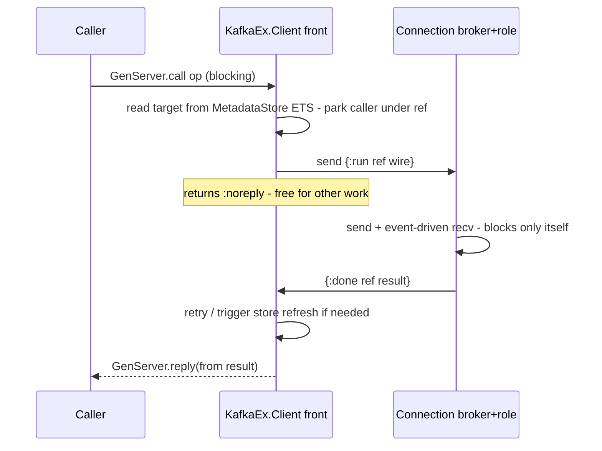

# Request lifecycle

> Reference companion to [RFC 0001 — Non-blocking process architecture for `KafkaEx.Client`](../../rfcs/0001-client-process-architecture.md).
> This document describes **how** the design works. It carries no decisions of its own: everything
> the RFC asks a reviewer to approve is in the RFC itself, in Design decisions and Trade-offs.

The caller keeps issuing a blocking `GenServer.call`. The front is a plain `GenServer` that
multiplexes many in-flight requests; each request's state lives in a `pending` map keyed by `ref`,
**not** in the process state (so `:gen_statem` does not fit the front — see [Design decisions](../../rfcs/0001-client-process-architecture.md#design-decisions)).

**What a `pending` entry holds.** Besides the `from` and the request: the current phase, the
persistent `attempt` counter, a **monitor on the caller** (whose pid arrives free in `from`), the
per-partition **gate slot** it holds (produce only), and an **absolute deadline**. The deadline is
admitted *with* the request. `KafkaEx.API` already computes the caller's budget via
`RequestBudget.call_budget/2` (`api.ex:967`) but passes it **only** as the `GenServer.call` timeout,
so the server never sees it — which means a promise like "no caller parked past its own deadline" is
not implementable until that number crosses the process boundary. It is therefore threaded into the
request message and stored as `deadline = monotonic_now + budget`. Re-deriving it inside the front
from `network_timeout` and `@retry_count` is the tempting shortcut and is wrong: `send_request/4`
lets a caller pass an arbitrary explicit timeout (`client.ex:1294`), and two independent computations
of one budget is exactly the drift #562 closed by making `@retry_count` the single source of truth.

Phases:

- `:resolving` — pick the target. Read the leader/coordinator from the `MetadataStore`'s ETS
  (lock-free). Hit → dispatch to the right `(node, role)` `Connection` (→ `:in_flight`). Miss → cast
  "refresh X" to the store and park as a continuation (→ `:awaiting_metadata` / `:awaiting_coordinator`).
- `:in_flight` — sent to a `Connection`; awaiting `{:done, ref, result}`.
- `:awaiting_metadata` / `:awaiting_coordinator` — waiting for the store's (coalesced) refresh to
  complete and notify; on notification, re-enter `:resolving`.
- `:awaiting_connection` — the target `Connection` refused a request it never wrote
  (`{:error, :not_connected}`); the entry waits for that connection to report `:connected`, bounded by
  its own deadline. This costs **no** retry attempt — see [State machines](state-machines.md) for why.

**The unanswered-request case must be handled explicitly, or the design breaks a working feature.**
A `produce` with `acks: 0` gets **no broker response at all** — there is nothing to correlate and
nothing to wait for. Today the client already knows this: `client.ex:1356` sets `synchronous = false`
when `Map.get(request, :acks) == 0`. A front that waits for `{:done, ref, result}` on every dispatch
would park such a caller until its deadline and then report `{:error, :timeout}` for a send that
**succeeded** — turning a working fire-and-forget produce into a reported failure.

The rule: for a request the broker will not answer, the `Connection` completes it **on a successful
socket write** — it replies `{:done, ref, :ok}`, registers **no** `correlation_id`, and arms **no**
per-attempt timeout. The front replies success to the caller with no offset, and **never retries** it:
a resend could duplicate records, and there is no acknowledgement that could ever tell us whether the
first attempt landed (the same reasoning already recorded at `client.ex:851-853`).

On `{:done, ref, result}` the front runs the **existing** retry classification
(`Retry.leadership_error?` / `coordinator_refresh_error?` / transport-timeout):

- success → `GenServer.reply(from, result)`, terminal;
- retryable leadership error → cast "refresh this topic/partition" to the store (coalesced per key in
  its `in_flight` map), → `:awaiting_metadata`, decrement budget;
- retryable coordinator error → cast "re-discover" to the store, → `:awaiting_coordinator`;
- transport timeout **on a coordinator request** → reply error immediately (send-once). Today's
  `@coordinator_max_attempts = 1` stays a **structural** cap on JoinGroup/SyncGroup — not an
  error-keyed one — so it protects them whatever the transport returns; rejoin/commit re-issue higher
  up;
- other transport timeout (data) → re-dispatch (→ `:in_flight`), decrement budget;
- `{:error, :not_connected}` → `:awaiting_connection`, budget untouched;
- non-retryable / budget exhausted → reply error, terminal.

**The terminal paths are the load-bearing part.** An entry that ends without being cleaned up does not
merely leak memory: while it holds a produce-gate slot at `N = 1` it stalls its entire partition,
silently and indefinitely — the very failure class (#357) this RFC exists to remove. An entry is
dropped, its caller demonitored and its gate slot released (waking the next FIFO waiter) on **all** of:
reply to the caller, retry-budget exhaustion, **deadline expiry**, **caller `:DOWN`**, and
`Connection` `:DOWN`. The deadline and the caller monitor are complementary, not redundant — the
monitor catches a caller that died (which is what a `GenServer.call` timeout does to an ordinary
process), the deadline catches one that survived by catching the exit, and the deadline additionally
stops the front from *starting* an attempt that cannot finish in time.

**On backpressure.** The blocking contract does bound concurrency — one in-flight call per caller
process — but it bounds the `pending` map only for *live* callers. Boundedness under caller churn
comes from the monitors and deadlines above, not from the blocking contract itself. In-flight requests
per connection are therefore ceilinged by the number of concurrently calling processes; we state that
as an invariant rather than leave it an accident, and defer an explicit per-connection cap to the
future async primitive that breaks the one-call-per-caller property (see Broadway / GenStage). Java's
`max.in.flight.requests.per.connection` (default 5) exists mainly to bound reordering under retry —
which decision #13's `N = 1` produce gate already covers here — so a second cap would buy no
correctness we do not already have.

The one substantive refactor is turning the recursive retry loop — whose state currently lives on a
blocking stack frame — into this `ref`-keyed state machine. Retry stays centralized in the front;
metadata refresh is delegated to the store; only blocking I/O moves out. Per-attempt timeout lives in
the `Connection` (it holds the send timestamp) and is reported to the front as
`{:done, ref, {:error, :timeout}}`; the **retry decision** stays in the front. A `Connection` `:DOWN`
fails every `pending` entry routed to it — one of the five terminal paths above, not the only one.
Replying to a `from` whose caller already timed out is a harmless no-op.

Each physical dispatch uses a **fresh `ref`** as its `pending` key, so a late `{:done, …}` from a
superseded or timed-out attempt lands on no entry and is dropped; the connection boundary reinforces
this — a re-dispatch after a leadership change goes to a *different* `Connection` process (its own
`correlation_id` space), and a dead one's entries are already failed via `:DOWN`. Distinct from that
matching key, a **separate `attempt` counter** rides the logical request (it *survives* every retry,
whereas the key dies with each attempt) and drives backoff, the retry budget, and the telemetry
attempt number. The two are deliberately **not** one token: their lifetimes are opposite.

