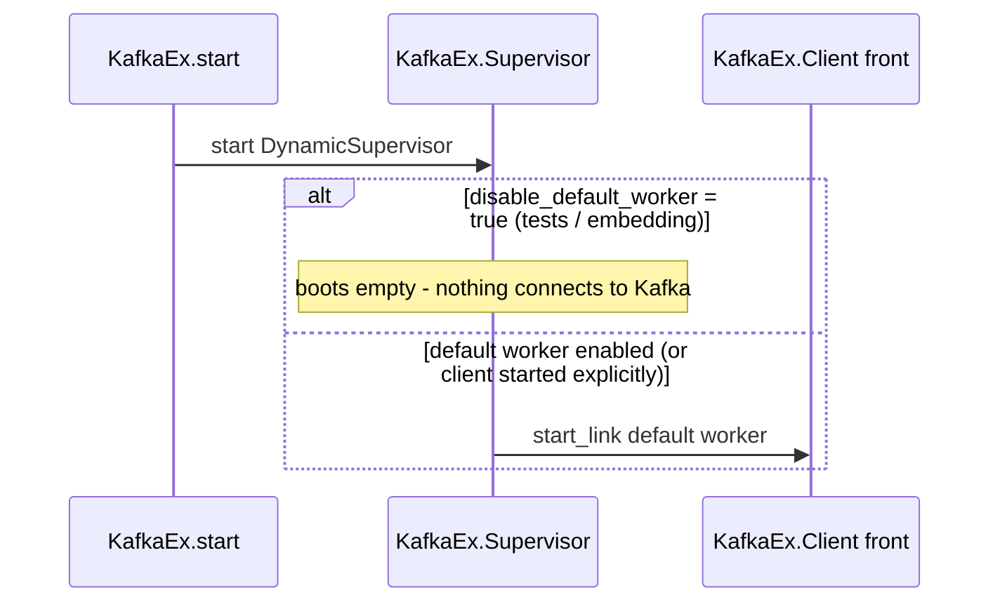
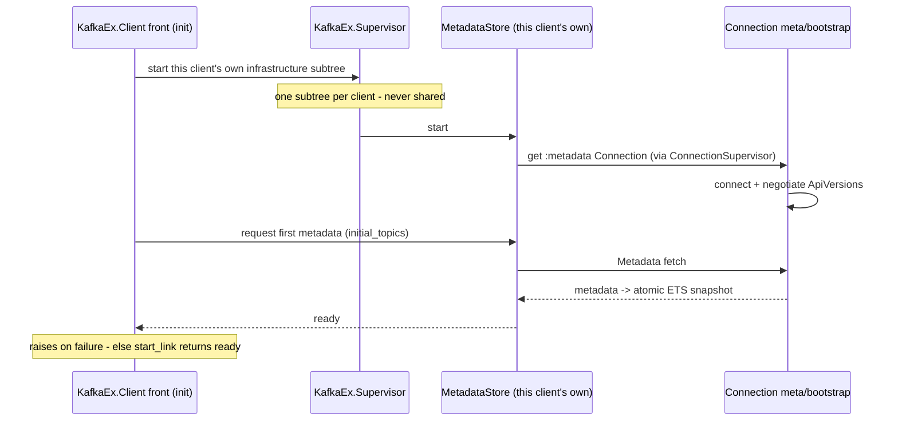

# Startup and application boot

> Reference companion to [RFC 0001 — Non-blocking process architecture for `KafkaEx.Client`](../../rfcs/0001-client-process-architecture.md).
> This document describes **how** the design works. It carries no decisions of its own: everything
> the RFC asks a reviewer to approve is in the RFC itself, in Design decisions and Trade-offs.

Two levels, top to bottom. The **OTP application boot is unchanged**; only what a client's `init`
does internally changes. Because infrastructure is per-client, **every** client boots its own
`MetadataStore` + connection set the same way — there is no "attach to an existing shared subtree"
path.

**1. Application boot (unchanged).** `KafkaEx.start/2` starts `KafkaEx.Supervisor` (a
`DynamicSupervisor`, `:one_for_one`) and, unless `disable_default_worker` is set, starts the default
worker (`kafka_ex.ex:176-194`). `disable_default_worker: true` — the common test / embedding setting —
boots the supervisor **empty**: no client, no per-client infrastructure, no `MetadataStore`, no
`Connection`, no socket to Kafka, until something explicitly starts a client. `mix test.unit` relies
on this: tests either start no client and drive modules directly, or start a client against the
in-process **fake `Transport`**.

**2. Client boot.** The front's `init` stays **synchronous and fail-fast** (matching
`client.ex:95-181`): it starts and links its own `Infra.Supervisor` (`Registry`,
`ConnectionSupervisor`, `MetadataStore`); the store obtains a `:metadata` `Connection` **through the
`ConnectionSupervisor`**, negotiates ApiVersions, and performs the first metadata fetch into the ETS
snapshot. `init` **raises on any
failure** — a fail-fast infra child makes `Supervisor.start_link` return `{:error, …}` cleanly,
*without* a race and *without* the front needing to trap exits — so `start_link` returning means the
client is ready, and an unreachable cluster at boot crashes for the parent to retry. `initial_topics`
warms this first fetch; it does **not** force data connections.

Every additional client (e.g. a group's `Manager` and each `GenConsumer`, absent a shared `:client`)
repeats **Client boot** independently: its own `MetadataStore`, its own negotiation, its own metadata
fetch, its own connection set. This is the deliberate cost of per-client infrastructure — the "N
clients per group" footprint is collapsed only when the caller opts into a shared `:client`
(`resolve_client`, #581), exactly as today. Automatic cross-client sharing is a future option (see
Alternatives).

**When connections are established.** Eager, at boot: only the meta/bootstrap `Connection` needed for
fail-fast. Lazy, on demand: per-broker **data-role `Connection`s** are created on the first request
routed to that `(node, role)`, via the `ConnectionSupervisor`. This is a deliberate improvement over
today, where `init` eagerly opens a socket to every bootstrap broker and `update_metadata` opens one
to every broker in metadata — including brokers the client never talks to (`client.ex:112-124`). Lazy
per-broker connect matches brod/Java/librdkafka.

