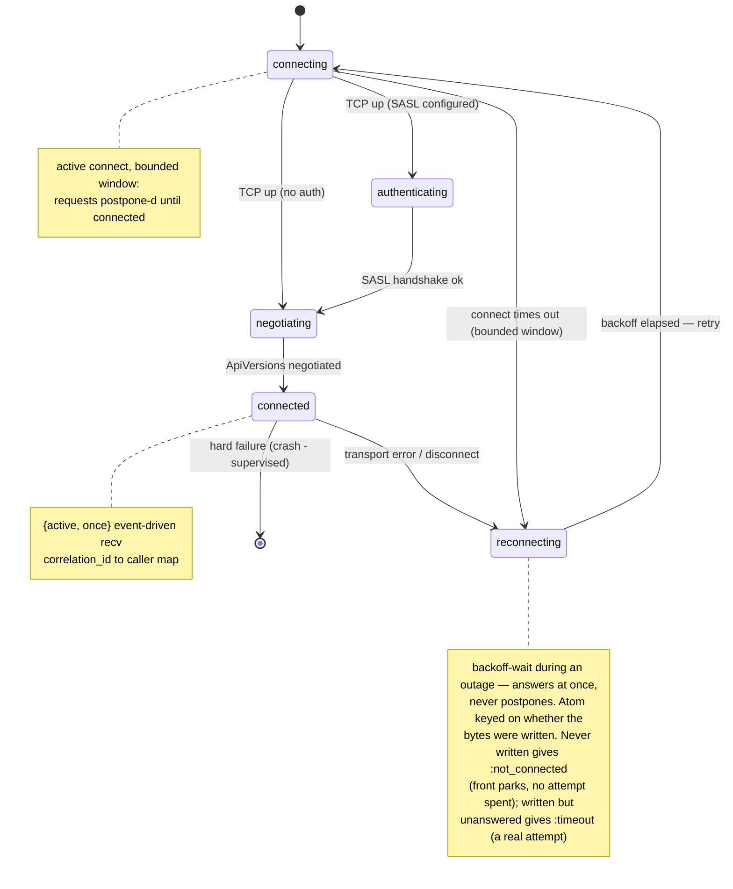
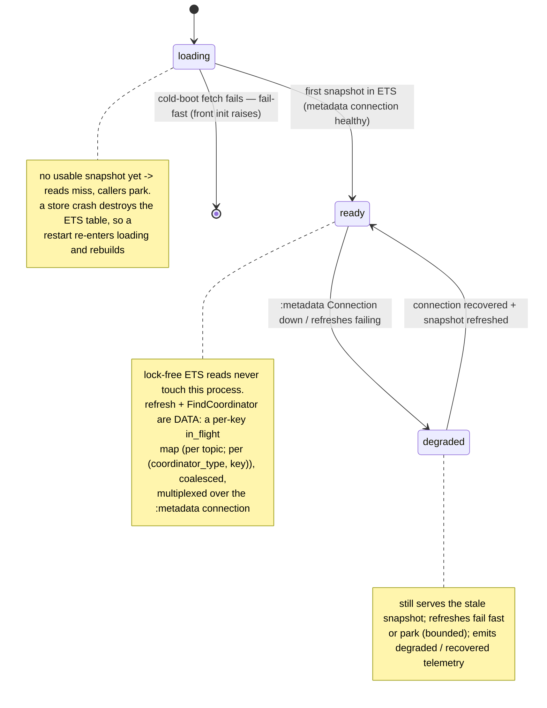

# State machines: Connection and MetadataStore

> Reference companion to [RFC 0001 — Non-blocking process architecture for `KafkaEx.Client`](../../rfcs/0001-client-process-architecture.md).
> This document describes **how** the design works. It carries no decisions of its own: everything
> the RFC asks a reviewer to approve is in the RFC itself, in Design decisions and Trade-offs.

Two processes in the design are explicit `:gen_statem`s — the `Connection` and the `MetadataStore` —
because each has real, named lifecycle states; everything else (the front) stays a plain `GenServer`.

**`Connection`** mirrors librdkafka's per-broker state machine; states model real protocol steps:

- `postpone` defers a request only **during an active connect, within a bounded window** (the
  `:connecting` state) — no hand-rolled queueing for the sub-second handshake. Once a drop pushes the
  connection into **`:reconnecting`** (backoff-wait during an outage) it does **not** postpone: it
  answers immediately, so its mailbox cannot grow unbounded. Waiting, where waiting is the
  right answer, happens in the **front** — the only process that holds the caller's absolute deadline.
  The `Connection` never learns that deadline, which is exactly why it must not be the process that
  parks on it. Symmetric with the store's `:degraded` mode.
- **The error atom is keyed on whether the request's bytes reached the socket.** That is the only
  thing separating "the broker never saw this" from "the broker may already have executed it", and the
  `Connection` is the sole process that knows which:
  - **never written** (it arrived while reconnecting) → `{:error, :not_connected}`. Re-sending cannot
    duplicate anything, so the front **parks** the entry until the `Connection` reports `:connected`
    or the caller's deadline expires — and **spends no retry attempt** on it.
  - **written, connection died before a response** → `{:error, :timeout}`, the same atom today's
    recv-deadline produces. `Retry.transport_timeout?/1` therefore keeps firing and coordinator
    requests keep their send-once rule (`client.ex:967-971`) bit-for-bit.
- Collapsing both into one retryable atom would do two silent kinds of damage: it would convert
  send-once coordinator requests into retried ones during precisely the rebalance/outage window where
  today's client deliberately refuses, and it would let three fail-fast refusals burn a caller's entire
  retry budget in microseconds without one real network attempt. Today's client is safe from the
  second only by accident — its retry recursion (`client.ex:929-956`) has **no** inter-attempt delay
  and is spaced solely by blocking I/O. Fail-fast removes that spacing, so it is replaced deliberately:
  by parking against a deadline rather than by counting attempts. Any delay in the front is a timer
  plus a parked entry, **never** `Process.sleep` — `Retry.with_retry/2` sleeps (`retry.ex:180`) and is
  therefore unusable in a process that serves every caller.
- On a transient disconnect it fails its in-flight requests (replying to the front under the split
  above), transitions to `:reconnecting` (backoff), and self-heals; hard/unexpected failures crash and
  are handled by supervision. It never re-implements a supervisor.
- Registered in the connection `Registry` keyed by `{host, port, role}` within its client's subtree,
  where `role ∈ {:data, :coordinator, :metadata}`. The **coordinator** gets its own connection —
  separate from data traffic even to the same physical broker — a convergent pattern in **all three**
  reference clients (see [Prior art](../../rfcs/0001-client-process-architecture.md#prior-art)), and what removes the Heartbeat-vs-fetch head-of-line coupling
  behind the black-holed-broker stall. The dedicated **`:metadata`** socket is **brod-only** among the three; we adopt it
  anyway because sockets are cheap on the BEAM and it decouples metadata correctness from the
  fetch/data model.
- Multiple in-flight requests per socket are matched by a **`correlation_id → caller` map** (as brod
  and librdkafka do; order-independent). Per-partition **produce** ordering is enforced **in the front**
  (the router/retrier), *not* in the `Connection`: the front admits at most **N in-flight produce per
  partition** — `N = 1` today (a mute), `N ≤ 5` later gated by idempotent sequence numbers — so the
  connection never serializes across partitions and a front-driven retry can never reorder a partition.

**`MetadataStore`** is a `:gen_statem` whose three states are *lifecycle*, **not**
refresh-bookkeeping: `:loading` (no usable snapshot yet), `:ready` (serving, cluster reachable), and
`:degraded` (serving a stale snapshot, cluster currently unreachable). Refresh and `FindCoordinator`
are **data, not states** — a per-key `in_flight` map (see below). Reads never enter any state; they
hit ETS lock-free:

- `:loading` obtains the store's `:metadata` `Connection` (through the `ConnectionSupervisor`),
  negotiates, and does the first metadata fetch into ETS. A failed first fetch is fail-fast (crashes
  the store; on cold boot the front's `init` raises). A **store crash destroys its ETS table**, so a
  restart also re-enters `:loading` and rebuilds — during that gap the front's reads miss and callers
  park until `:ready`.
- `:ready` — a fresh snapshot is in ETS and the cluster is reachable; fronts read lock-free, off the
  mailbox; refreshes complete normally.
- `:degraded` — the `:metadata` `Connection` is down (that `Connection`'s own `:gen_statem` is already
  retrying with backoff one level below); the store keeps serving the **stale** ETS snapshot, but a
  refresh it cannot complete either fails fast with `{:error, :no_broker}` — the atom today's client
  already returns when no broker can be selected (`client.ex:1361`) and which
  `Retry.transient_error?/1` already classifies as retryable — or parks within a
  bound (the store-side of the same "never park unboundedly during an outage" rule). A *new* atom
  here would be worse than a less descriptive one:
  unknown atoms fall through `Retry.transient_error?/1` to `false`, so naming the most transient
  condition there is would make the client give up on it permanently. The descriptive signal belongs
  in telemetry, not in the return value. Entering/leaving emits
  `[:kafka_ex, :metadata_store, :degraded]` / `:recovered` — a resilience signal aligned with the
  black-holed-broker motivation.
- **Refresh & discovery are data.** A per-key `in_flight` map holds one coalescing entry per refresh
  target (per topic) and per `(coordinator_type, key)` coordinator discovery, each with its waiter set
  and `epoch`. Concurrent triggers for the same key **join** the in-flight entry (this closes the #445
  race and de-storms coordinator re-discovery when a coordinator moves); different keys proceed in
  parallel, multiplexed over the one `:metadata` connection. On completion the store swaps the ETS
  snapshot atomically, bumps the `epoch`, and wakes its front. This is deliberately **not** a
  `:refreshing` state — one global refresh state would force global single-flight and serialize
  unrelated refreshes.
- The **lost-wakeup** guard is also data: each round carries an `epoch`, a parked front re-checks ETS
  after parking, and the store always sends a wakeup — so a front parking just after a refresh
  completes cannot miss it.

(`FindCoordinator` in-flight coalescing keyed per `(coordinator_type, key)` goes one step beyond
brod/Java/librdkafka — they coalesce only per-instance or dedup the *resolved* result, not the
in-flight lookup — justified here because the store owns discovery and a waiter list is cheap on the
BEAM.)

