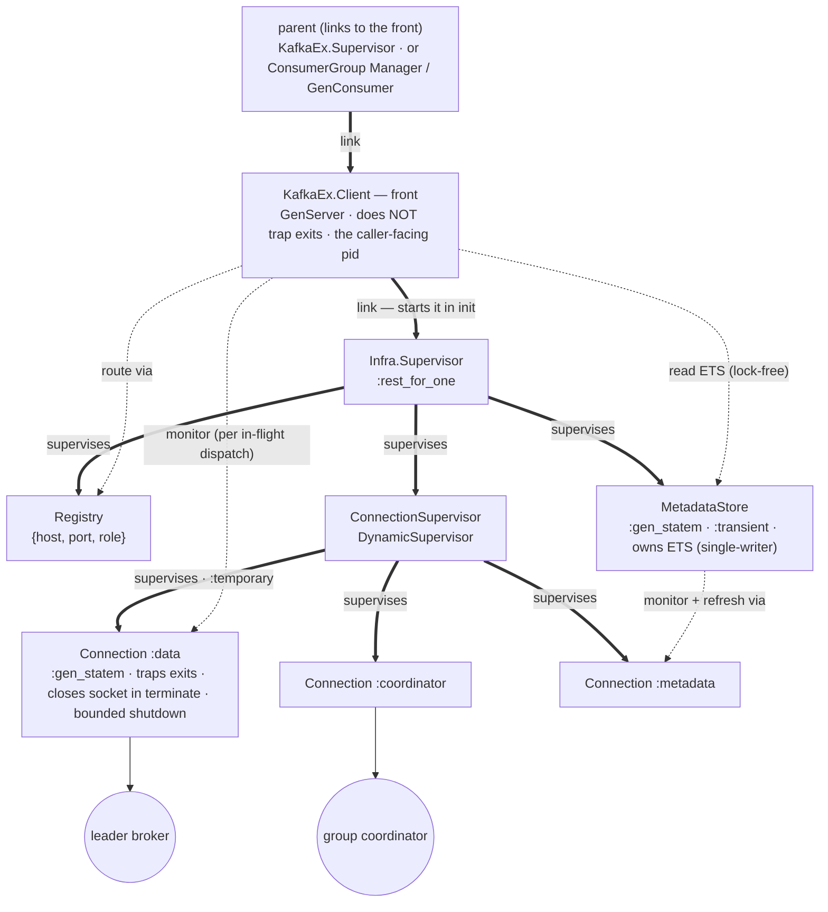
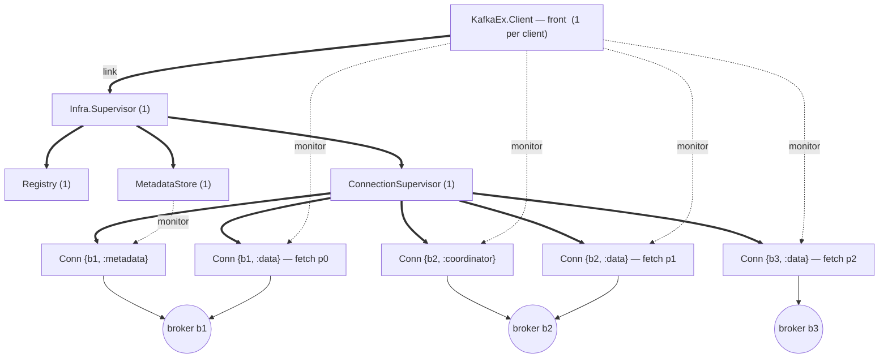

# Supervision, ownership and teardown

> Reference companion to [RFC 0001 — Non-blocking process architecture for `KafkaEx.Client`](../../rfcs/0001-client-process-architecture.md).
> This document describes **how** the design works. It carries no decisions of its own: everything
> the RFC asks a reviewer to approve is in the RFC itself, in Design decisions and Trade-offs.

Edge styles follow the legend below the diagram: thick `⇒` = link / supervision (lifetime-coupled),
dotted `⇢` = monitor or lock-free use (no lifetime coupling).

**Edge legend.** Thick `⇒` = **link / supervision** (lifetime-coupled: if the source dies, the
target is torn down). Dotted `⇢` = **monitor or lock-free use** (a one-way death signal, or an
ETS/Registry read — *no* lifetime coupling). A second client is an identical, fully independent
subtree hanging off its own parent; nothing is shared between clients.

**Lifetime & teardown (resolved).** The front is the process the parent links to and callers hold;
in its `init` it starts (and thereby links to) its own `Infra.Supervisor`. Teardown rides that link,
**not `terminate/2`**: when the front stops — a `GenServer.stop` from a `Manager`/`GenConsumer`, or a
`:shutdown` from the application supervisor — its supervised `Infra.Supervisor` is torn down in order,
and each `Connection` closes its socket in its **own** `terminate/2` (so a non-trapping front skipping
`terminate/2` on `:shutdown` costs nothing). The front does **not** trap exits: a crash of an
individual `MetadataStore`/`Connection` is absorbed by the `Infra.Supervisor`'s restart and the front
only re-resolves off the monitor `:DOWN`; the front dies only if the `Infra.Supervisor` itself
exhausts its restart intensity, at which point its parent recreates the whole client. `Connection`s
carry a bounded shutdown so that N per-partition `:ssl.close/1` calls (closed in parallel under the
`DynamicSupervisor`) cannot exceed the caller's teardown budget.

**A concrete instance — three brokers.** The diagram above is schematic (it shows *roles*, not
counts). Instantiated for a 3-broker cluster (`b1`/`b2`/`b3`) with one topic `orders` whose partitions
`p0`/`p1`/`p2` lead on `b1`/`b2`/`b3`, a consumer group whose coordinator is `b2`, and a client
consuming all three partitions:

The singletons (`front`, `Infra.Supervisor`, `Registry`, `MetadataStore`, `ConnectionSupervisor`) are
**one each regardless of broker count**; only `Connection`s scale, one per `{broker, role}` in use.
One physical broker can back **several** sockets under different roles — here `b1` carries both
`:metadata` and the `p0` `:data` socket, `b2` both `:coordinator` and the `p1` `:data` socket — which
is exactly the role separation that removes the Heartbeat-vs-fetch coupling behind the
black-holed-broker stall. The number of
`:data` `Connection`s is the one variable the fetch model sets: **per-partition** (default) gives one
per consumed partition (two partitions sharing a leader ⇒ two sockets to that broker), while the
`share_leader_conn` knob collapses them to one per broker.

The knob exists for the ordinary reason: fewer sockets, and fewer broker-side connections, when one
consumer holds many partitions led by the same broker.

It is worth stating what per-partition connections do **not** cost, since fetch sessions (KIP-227) are
the obvious worry. KafkaEx sends `session_id: 0` with `epoch: -1` on every v7+ fetch
(`protocol/kayrock/fetch/request_helpers.ex:121-122`), nothing in `lib/` overrides either, and the
`session_id` a broker returns is never carried into the next request — so no incremental fetch session
is ever sustained and every fetch is a full fetch. Per-partition connections therefore consume nothing
from a broker's session-slot cache. That ceiling becomes real only if incremental fetch is adopted
later, where it is a **precondition of that change** rather than a cost of this one.

**Who owns what.**

- **`KafkaEx.Client` (front).** A plain `GenServer`, one per user client — it *must* be the process
  returned by `start_link/2` and registered under `name`, because callers hold that pid and issue
  `GenServer.call` on it, so it cannot itself be a supervisor. It routes, retries, and holds parked
  callers in the `pending` map; it never does blocking I/O. Its infrastructure (`MetadataStore`,
  `Registry`, `ConnectionSupervisor`) is owned by this client via an `Infra.Supervisor` it **starts
  and links to in `init`** (the front does not trap exits); that link makes teardown automatic (see
  Lifetime & teardown) and keeps the front the caller-facing pid without itself being a supervisor.
- **`Infra.Supervisor` (per client, `:rest_for_one`).** Groups, in order, the client's `Registry`,
  `ConnectionSupervisor`, then `MetadataStore` — Registry first so the others can register, and
  `ConnectionSupervisor` before the store because the store obtains its `:metadata` `Connection`
  *through* the `ConnectionSupervisor` (so under `:rest_for_one` a `ConnectionSupervisor` restart also
  restarts the store, its dependant). Started and linked by the front in `init`. A `MetadataStore`/`Connection` crash is absorbed by a restart
  here and never takes the front down; the whole subtree stops with the client because the front is
  its supervised parent (the link). `MetadataStore` is `:transient` and the supervisor's restart
  intensity is tuned so transient store flapping self-heals rather than toppling the front.
- **`MetadataStore`.** A `:gen_statem` (states `:loading`/`:ready`/`:degraded`; fail-fast `init`).
  Owns the metadata ETS table (lock-free reads), is the single writer and the per-key
  refresh/coordinator-discovery coalescer, and uses a `:metadata`-role connection to refresh
  (mirroring brod's dedicated `meta_conn`). Reads never touch its mailbox.
- **`ConnectionSupervisor` + `Connection`s.** Per-broker, per-role `:gen_statem` connections
  (see [State machines](state-machines.md)), `:temporary` children created lazily and registered in the `Registry` keyed by
  `{host, port, role}` (ssl/auth are implied by the owning client's identity).

**Failure blast radius.**

- **A `Connection` crash is isolated.** Its front fails the `pending` entries routed to it (never
  leaked) and it is recreated lazily on the next request — no eager reconnect storm.
- **A front crash affects only its own callers** — and, because infrastructure is per-client, its own
  infrastructure. No other client is touched (there is nothing shared to touch).
- **A `MetadataStore` crash** restarts under its client's own supervisor. Its ETS table dies with it
  (a dead owner's tables are destroyed on the BEAM), so the restarted store re-enters `:loading` and
  rebuilds the snapshot; during that brief gap the front's reads miss → it parks callers in
  `:awaiting_metadata` and re-resolves once the store is `:ready` again. The gap is one metadata fetch
  and touches only this client.
- **`MetadataStore` (single writer) closes the #445 concurrency class** for its client: concurrent
  produces to a missing topic coalesce onto one refresh instead of racing.

**Links, monitors, and who cleans up.** The design uses three distinct BEAM mechanisms on purpose —
supervision **links** (shared lifetime), **monitors** (a one-way death signal that does *not* couple
lifetime), and **`Registry`** (which monitors its registrants for us). There is **no hand-rolled
"live connections" table** that could drift from reality: a dead process simply disappears from the
registry. Reading the edges as *observer → observed*:

| Observer → Observed | Mechanism | What happens when the observed dies |
|---|---|---|
| `ConnectionSupervisor` → `Connection` | supervision link, `:temporary`, bounded shutdown | **not** restarted (temporary); recreated lazily on the next request. On an ordered shutdown the `Connection` (which traps exits) closes its socket in its own `terminate/2` |
| connection `Registry` → `Connection` | Registry's built-in monitor | Registry **auto-removes** the `{host, port, role}` entry — no manual cleanup; a later lookup misses and the front asks `ConnectionSupervisor` for a fresh one |
| front → `Connection` | **monitor** (not link) | on `:DOWN` the front fails every `pending` entry routed to that connection — one of the five terminal paths that clean an entry up, see [Request lifecycle](request-lifecycle.md); the crash never takes the front down. The front demonitors when it stops routing there |
| `MetadataStore` → its `:metadata` `Connection` | **monitor** | a mid-refresh `:DOWN` fails the in-flight refresh; the store re-acquires the connection on the next refresh |
| front → its `MetadataStore` | **monitor** (+ notify subscription) | a store restart makes ETS reads miss; the front parks callers in `:awaiting_metadata` and re-resolves once the store is `:ready` again |
| front → **the caller** | **monitor** per admitted request (the pid arrives free in `from`) | on `:DOWN` the front drops that `pending` entry and releases everything it held — most importantly its per-partition produce-gate slot, whose loss would stall that partition silently and permanently. A `GenServer.call` timeout kills an ordinary caller, so this covers the common give-up path; a caller that survives by catching the exit is covered instead by the entry's absolute deadline |
| front → its `Infra.Supervisor` | **link** (started in `init`) | this is the teardown mechanism: the front's death (any reason) tears the whole subtree down in order. Conversely, if `Infra.Supervisor` exhausts its restart intensity and exits, the non-trapping front dies with it and its parent recreates the client |
| `Infra.Supervisor` → {`Registry`, `ConnectionSupervisor`, `MetadataStore`} (`:rest_for_one`) | supervision link | a `MetadataStore` restart rebuilds from bootstrap (that front parks and re-resolves); a `Registry`/`ConnectionSupervisor` restart also restarts the store (its dependant) and drops connection registrations, recreated lazily |
| `KafkaEx.Supervisor` → per-client subtrees | supervision link | standard supervision; each client's front and its own infrastructure restart independently of every other client |

So the connection lifecycle is bookkept **twice, both automatically**: the `Registry` drops a dead
`Connection` from *routing* (lookups miss), and the front's `monitor` drops it from *in-flight
accounting* (`pending` entries fail). Neither is a hand-maintained map. The front holds exactly one
**link** — to its `Infra.Supervisor` — and everything else to individual infra processes is a
**monitor**: the link carries lifetime (teardown), while a `Connection` or `MetadataStore` crash
reaches the front only as a monitor `:DOWN` that leaves it alive to re-resolve. **Teardown is trivial
under per-client infrastructure:** the subtree has exactly one client, so the front's death tears it
down through that single link — no ref-counting of fronts and no idle-expiry negotiation (the question
that per-cluster sharing would have forced).

**Transport seam and testing.** The event-driven `Connection` replaces the synchronous
`NetworkClient.send_sync_request/3` Mimic seam that the current unit suite stubs. We introduce a
`Transport` behaviour (aligning with 06's `Transport.request/3` seam): production uses real
`gen_tcp`/`ssl`; **unit tests use an in-process fake transport** that delivers the *same* hand-built
wire bytes tests build today (e.g. `build_v0_metadata_response`) as `{:tcp, sock, data}` messages
instead of a function return — a mechanical port of the existing stubs. The decomposition is itself a
testability win: the front's state machine is testable against a **fake `Connection`** (a stub
replying `{:done, ref, result}`), and the `Connection` `:gen_statem` is testable against a **fake
`Transport`**. A handful of fake-broker tests (real loopback socket) exercise real framing and
multiplex/ordering; the existing Docker 3-broker integration suite remains the end-to-end gate.

