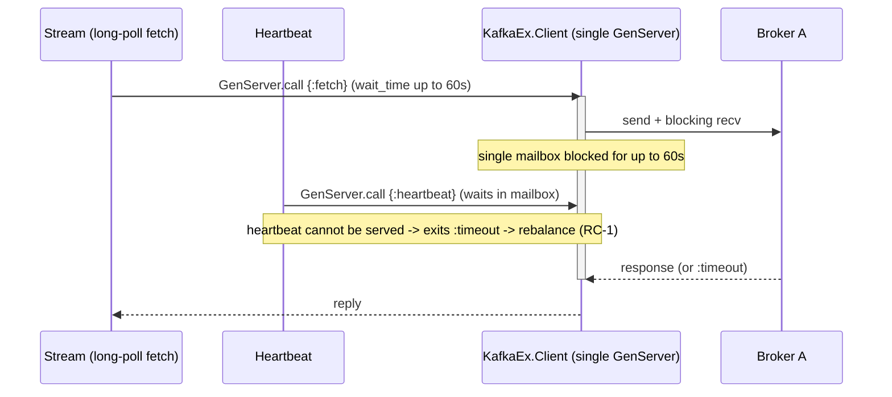
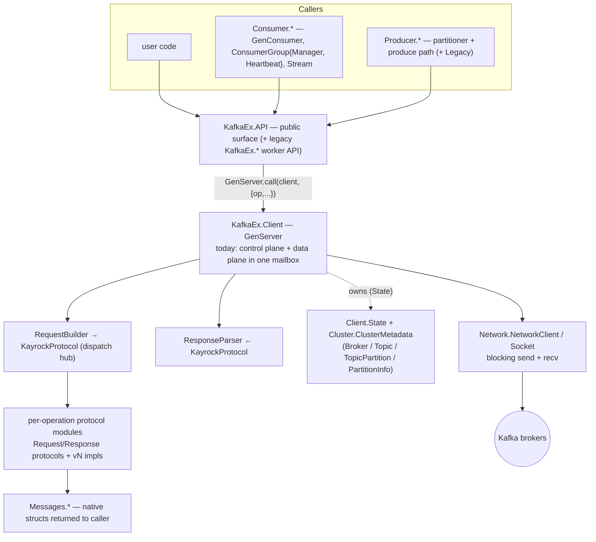
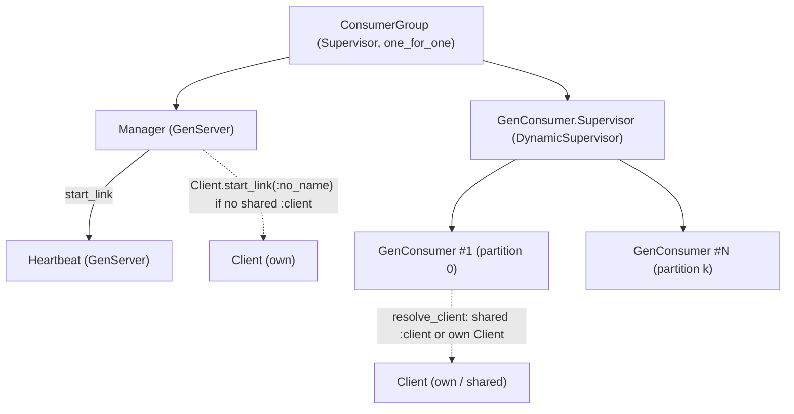
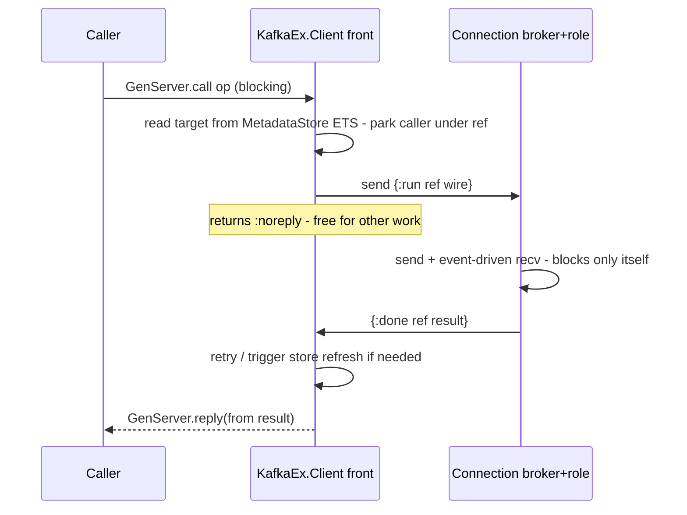
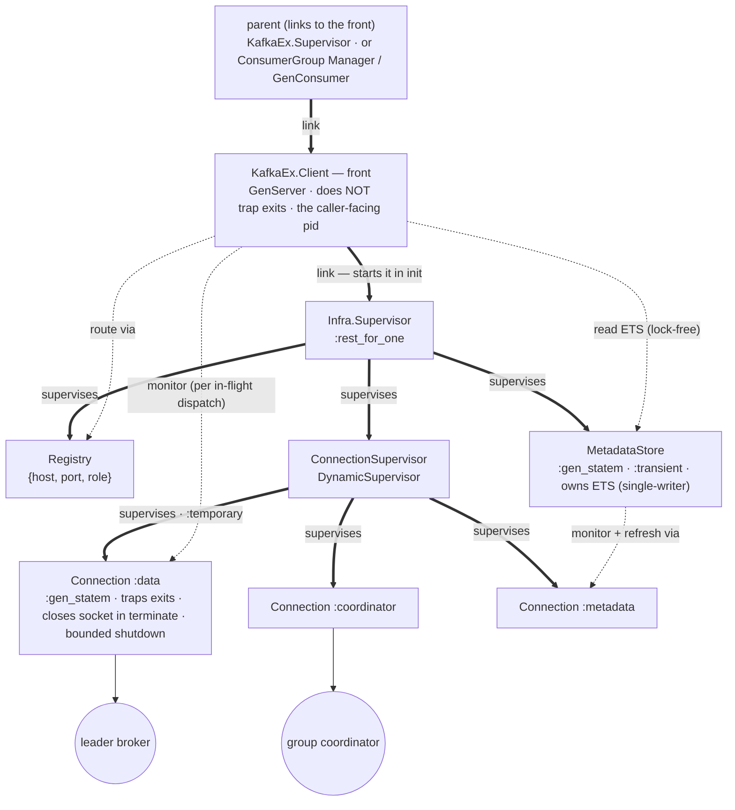
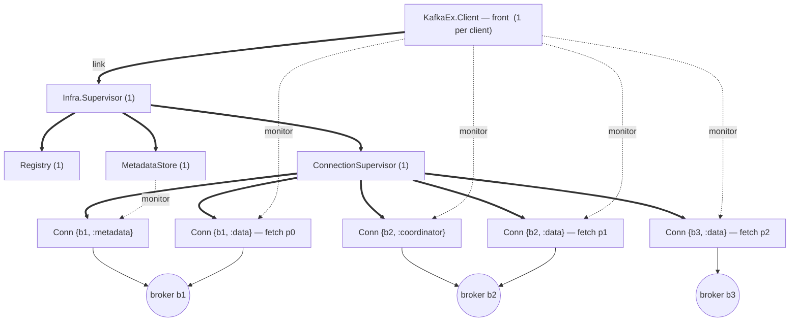
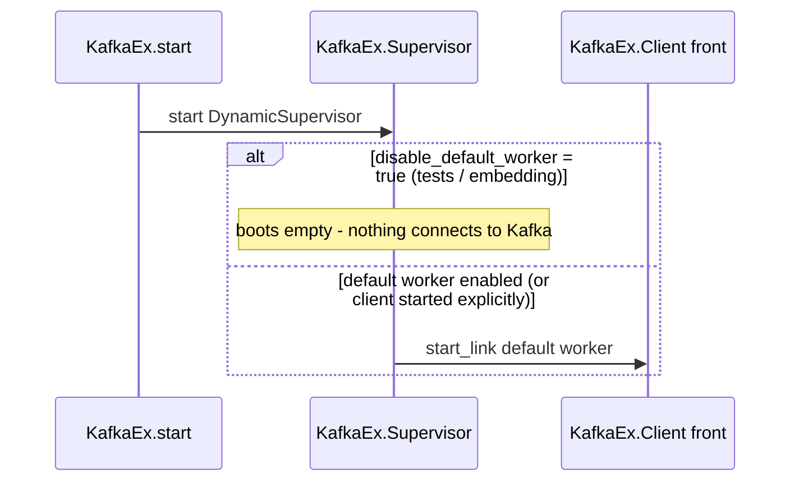
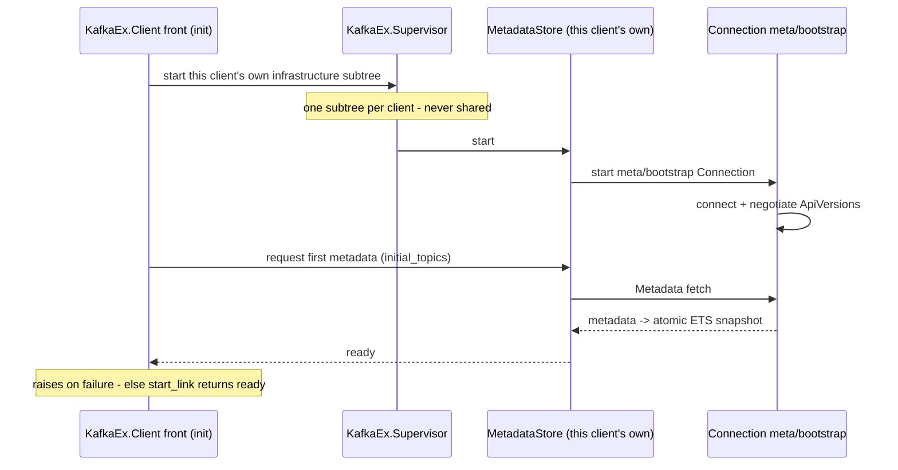
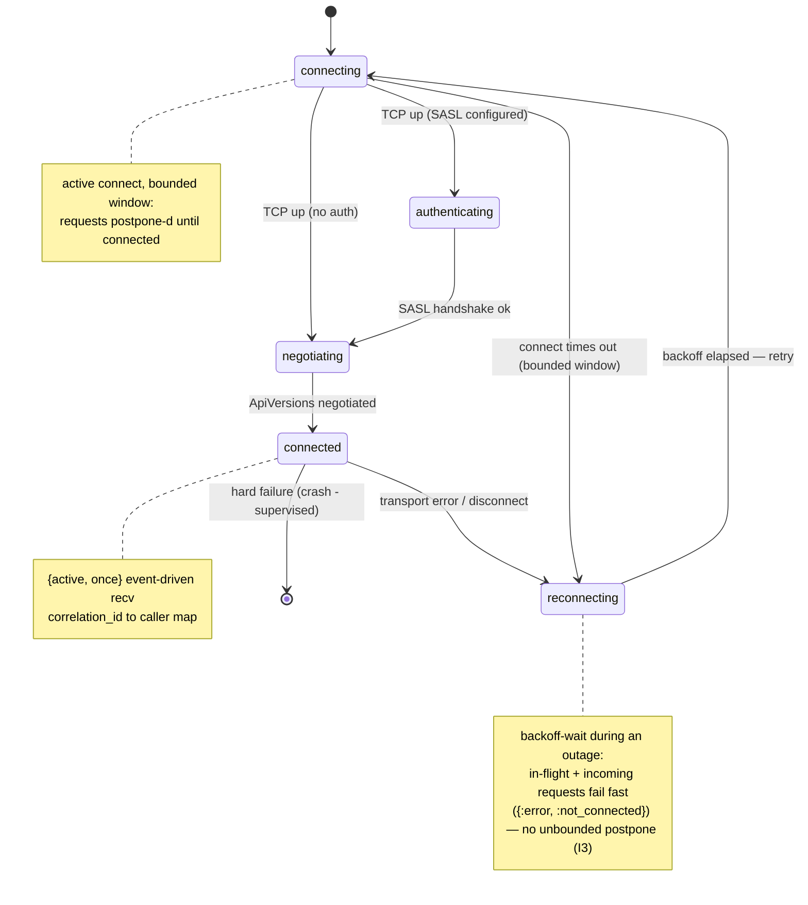
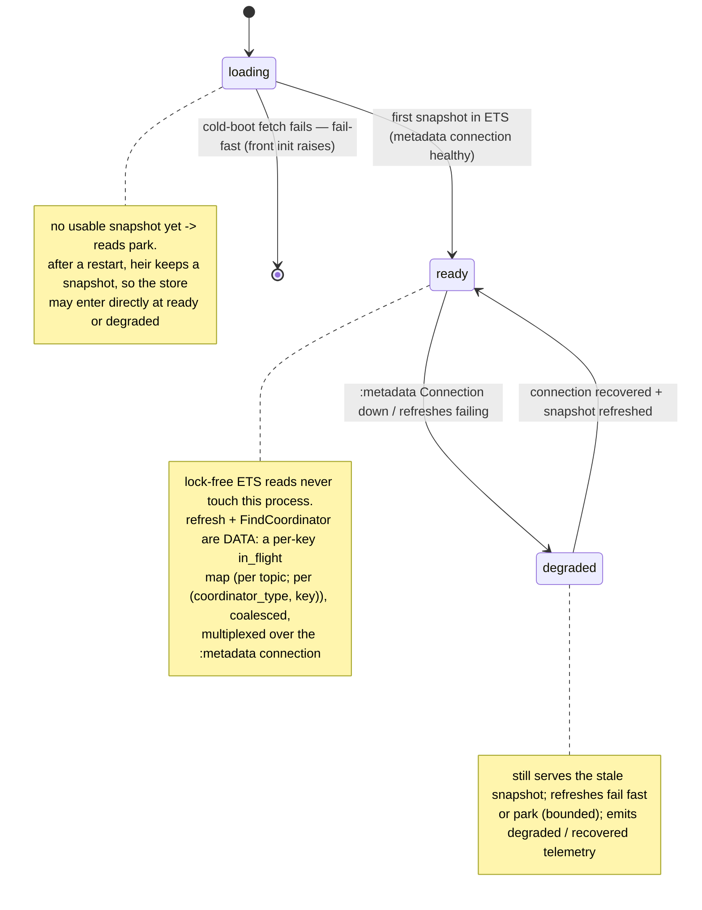

# RFC 0001: Non-blocking process architecture for `KafkaEx.Client`

- **Status:** Draft — request for comments
- **Author:** (KafkaEx maintainers / proposer)
- **Date:** 2026-07-28
- **Target release:** v1.2.0 (delivered incrementally; the public API is unchanged throughout)
- **Related issues:** #357 (`KafkaEx.stream` times out fetching at log-end), #445 (metadata cache not updated on produce)
- **Related design notes:** Connection + pure Broker (06), decentralised data plane (10), deepen ClusterMetadata (14), shared metadata store / `TopicsLibrary` (23)

## Summary

Split the single `KafkaEx.Client` `GenServer` into a small process tree that separates the
**control plane** (metadata, coordinator resolution, routing, retry) from the **data plane**
(per-broker socket I/O), so that no single slow or unresponsive broker can block unrelated work.
Each client owns its **own** supervised infrastructure — one `MetadataStore` and one set of
`Connection`s per client — independently supervised from the front so that blocking socket I/O and
metadata refresh never share the front's mailbox. Infrastructure is deliberately **per-client, not
shared across clients**: this mirrors the Java client and librdkafka (per-instance) and brod (which
shares only through an explicitly named client). The "N clients per consumer group" footprint is
addressed by the existing opt-in shared `:client` (`GenConsumer.resolve_client`, #581), **not** by
auto-keyed cross-client sharing, which is left as a future option. The change is **fully backward
compatible**: the public API, the `client` process identity and message contract, telemetry, and
failure semantics are unchanged.

## Current Limitations

`KafkaEx.Client` today is one `GenServer` that fuses three responsibilities into a single mailbox:

1. **Blocking per-broker socket I/O.** `NetworkClient.send_sync_request/3` flips the socket to
   `{active, false}` and blocks on `Socket.recv/3` **inside `handle_call`**
   (`lib/kafka_ex/network/network_client.ex:114-158`, driven from `client.ex network_request/4`).
2. **Metadata ownership and refresh.** Broker sockets live in `Broker.socket` inside
   `cluster_metadata` inside `Client.State`; the periodic refresh runs
   `:timer.send_interval → handle_info(:update_metadata)` in the *same* mailbox
   (`client.ex:171,384`).
3. **Retry / routing orchestration** (`handle_request_with_retry`, `refresh_for_error`).

A single monotonic `correlation_id` in `State` (`client.ex:1370`) means the client holds **at most
one request in flight** at any moment. Because everything shares one mailbox and one blocking
`recv`, a single broker freezes the whole client:

- **#357** — a long-poll `fetch` at the log end holds the `GenServer` for its full `wait_time`
  (up to ~60 s), so every other caller `GenServer.call` times out.
- **#445** — metadata reads and refresh queue behind slow socket I/O, so a produce can observe stale
  or mismatched topic metadata.
- **RC-1 / RC-3** (internal findings) — one "black-holed" broker (TCP up, no application reply)
  monopolises the shared client; the consumer-group `Heartbeat`'s queued call then exits `:timeout`,
  the `Manager` rebalances, and if the stall exceeds `session_timeout` the coordinator evicts the
  member: **a group-wide rebalance triggered by one unrelated broker**.
- The v1.1.0 timeout changes (`request_timeout` 1 s → 15 s, `heartbeat_interval` 5 s → 3 s, fetch
  transport `:timeout` retried ×3) **lengthened these blocking windows** on top of the shared
  mailbox.

Separately, because each client owns its own metadata and sockets, a consumer group holds **N copies**:
the `Manager` and every `GenConsumer` start their **own** `Client` unless handed a shared `:client`
(`manager.ex:266-270`, `gen_consumer.ex:641,679-693`; `resolve_client/3`, #581) — so N metadata
catalogs, N refresh loops, and N socket sets to the same brokers.

Today's request flow — one blocking `recv` in one mailbox means one broker freezes everything:



The goal is to remove head-of-line blocking and make metadata handling correct **without changing
any public API** — the client must stay a drop-in for every existing caller (`KafkaEx.API`, the
legacy `KafkaEx.*` worker API, `ConsumerGroup.Manager`, `Heartbeat`, `GenConsumer`, `Stream`).

**Expected outcome:** #357 fixed, #445 fixed, RC-1/RC-3 fixed, and metadata
refresh/heartbeats/produce to independent brokers proceeding in parallel — with zero changes required
from any library consumer. The "N clients per group = N metadata copies + N refresh loops + N socket
sets" footprint is **not** removed here; it remains collapsible, as today, by handing the group a
shared `:client` (`resolve_client`, #581). Cross-client sharing of metadata and connections is a
possible future option (see Alternatives), not part of this change.

## Current Architecture

Where this change sits in the existing module layout, in the project's own vocabulary — *public
surface → client → dispatch hub → per-operation protocol modules*, plus *control plane / data plane*,
*node selector*, *coordinator*, *cluster metadata model*, and *native message structs*.



**Layers (top → bottom):**

1. **Public surface — `KafkaEx.API`** (`api.ex`, `api/behaviour.ex`). The primary interface; every
   function takes `client` first and issues `GenServer.call(client, {op, …}, budget)`, returning
   `{:ok, result}` / `{:error, reason}` where `result` is a `Messages.*` struct. The legacy worker
   API (`kafka_ex.ex`: `create_worker`, `start_link_worker`, `KafkaEx.Supervisor`) sits alongside it
   for backward compatibility.
2. **Client — `KafkaEx.Client`** (`client/client.ex`), the `GenServer` that owns a cluster
   connection. Today it fuses **control plane** and **data plane**. Its support cast in `client/`:
   `state.ex` (`Client.State`), `node_selector.ex` (`NodeSelector`: `:first_available` /
   `:topic_partition` / `:consumer_group`), `request_builder.ex` / `response_parser.ex`,
   `request_context.ex` (`RequestContext`), `request_budget.ex`, `metadata_log.ex` (edge-triggered
   missing-topic logging), `error.ex`; plus shared `Support.Retry`, `Support.OptionalDeps`,
   `Telemetry` (the `[:kafka_ex, :request]` span), and `Config`.
3. **Dispatch hub — `Protocol.KayrockProtocol`** (`protocol/kayrock_protocol.ex`). The only place the
   rest of the client talks to the protocol layer: `build_request(op, api_version, opts)` and
   `parse_response(op, response)` branch by `{operation, version}`. Slated to become a separate
   package post-1.0.
4. **Per-operation protocol modules** (`protocol/kayrock/<operation>/`). Each operation defines the
   `Request`/`Response` Elixir protocols (`@fallback_to_any true`) plus one
   `vN_request_impl.ex` / `vN_response_impl.ex` per API version, an `any_*_impl.ex` forward-compat
   fallback, and shared `request_helpers.ex` / `response_helpers.ex`.
5. **Network — `Network.NetworkClient` / `Network.Socket`** (`network/`). Stateless plumbing:
   `create_socket`, `send_sync_request` (`{:packet, 4}` framing, the **blocking `Socket.recv`** that
   this RFC targets), `close_socket`. `network/behaviour.ex` is the mock seam (Mimic).
6. **Data model — `Cluster.*` and `Messages.*`.** `Cluster.*` (`cluster_metadata.ex`, `broker.ex`,
   `topic.ex`, `topic_partition.ex`, `partition_info.ex`) is the broker/topic/partition/leader model;
   `ClusterMetadata` also carries the **coordinator cache** and today transplants live sockets in
   `Broker.socket`. `Messages.*` are the native structs returned to callers (`Fetch`, `Fetch.Record`,
   `RecordMetadata`, `Offset`, `ConsumerGroupDescription`, …).

**Callers of the client.** All reach the client through `KafkaEx.API` → `GenServer.call(client, …)`:
`ConsumerGroup.Manager` (join / sync / leave, offset fetch / commit), `ConsumerGroup.Heartbeat`
(**its call is the one that exits `:timeout`** when the client is blocked → RC-1), `GenConsumer`
(fetch, offset commit), `Stream` (fetch; the long-poll at log-end is **#357**), `Producer.*`, and the
legacy `KafkaEx.*` worker API.

**Consumer-group process tree, and where the client comes from:**



**Key fact (verified in code):** the `Manager` and every `GenConsumer` **start their own `Client`**
unless handed a shared `:client` in opts. Hence "N clients per group = N metadata copies + N refresh
loops + N socket sets" — a footprint this RFC leaves collapsible via that same shared `:client`, not
via auto-sharing. The new processes this RFC introduces (`Connection`, `ConnectionSupervisor`,
`MetadataStore`, and the supervisor that groups them) are **per-client infrastructure**: each
`Client` keeps its identity as a thin front and owns its own store and connection set, independently
supervised from the front.

## End State Architecture

The mental model is a **control plane vs data plane** split, on two axes:

- **Data plane** = per-broker, per-role `Connection` processes. Each owns exactly one socket and its
  own `correlation_id`, is **event-driven** (`{active, once}` — never a blocking `recv`), and blocks
  only itself. A slow fetch on broker A no longer affects broker B, and coordinator/heartbeat traffic
  rides a *different* connection than data traffic even to the same broker. Connections belong to
  **one client**, resolved through that client's own `Registry`.
- **Control plane** = routing + retry (the front `KafkaEx.Client`, one per user client) and metadata +
  coordinator discovery (a **`MetadataStore` owned by that same client**). Each client owns the
  metadata for its own connection to the cluster.

Infrastructure is **per-client**: each `KafkaEx.Client` owns its own `MetadataStore` and connection
set, and two clients — even with identical credentials to the same cluster — never share a socket or
a metadata refresh. This keeps the trust boundary trivially safe (nothing crosses between clients)
and is the same choice the reference clients make by default (Java/librdkafka per-instance; brod
shares only via an explicitly named client). Auto-sharing metadata/connections across clients that
happen to share a `{bootstrap, ssl, auth}` identity is a **future option** (see Alternatives), not
built here.

From a caller's perspective **nothing changes**. A caller still writes:

```elixir
GenServer.call(client, {:fetch, topic, partition, offset, opts}, budget)
```

Under the hood the front `KafkaEx.Client` no longer blocks: it looks up the target (a lock-free ETS
read from the `MetadataStore`), hands the request to that broker/role `Connection` asynchronously,
and parks the caller until the answer comes back — while remaining free to serve heartbeats, metadata
refreshes, and requests to other brokers.

**Backward-compatibility contract (invariant):**

- `KafkaEx.Client` remains the named front process answering the same `GenServer.call({op, …})`
  messages.
- `start_link(args, name)` still returns `{:ok, pid}`, registers `name`, and is ready on return
  (synchronous fail-fast boot).
- `send_request/4`, `retry_count/0`, `coordinator_max_attempts/0` are unchanged.
- All telemetry event **shapes** (names + measurements) are unchanged. Operation spans
  (`:produce`/`:fetch`/`:consumer.*`) stay in the front (same pid as today's client); the per-attempt
  `[:kafka_ex, :request]` span and the `:connection`/`:auth`/`:connection.close` events move to the
  `Connection` (their emitting pid changes). Under the async model emission shifts from the synchronous
  `Telemetry.span/3` wrapper to manual `:start`/`:stop`.
- The front client stays the failure unit that `ConsumerGroup` supervision monitors.
- `MetadataStore`, `Connection`, the per-client `Infra.Supervisor` grouping them, and the connection
  `Registry` are strictly internal; callers never address them.
- The OTP application boot (`KafkaEx.Supervisor`) and the `disable_default_worker` flag are unchanged:
  a disabled default worker still means no client and no connections until one is explicitly started,
  so `mix test.unit` still needs no Kafka cluster.

### Sequence

The caller keeps issuing a blocking `GenServer.call` (this contract also gives us **free
backpressure** — each caller process can only have one call in flight, so the front's `pending` map
is bounded by the number of caller processes). The front is a plain `GenServer` that multiplexes many
in-flight requests; each request's state lives in a `pending` map keyed by `ref`, **not** in the
process state (so `:gen_statem` does not fit the front — see Design decisions):

- `:resolving` — pick the target. Read the leader/coordinator from the `MetadataStore`'s ETS
  (lock-free). Hit → dispatch to the right `(node, role)` `Connection` (→ `:in_flight`). Miss → cast
  "refresh X" to the store and park as a continuation (→ `:awaiting_metadata` / `:awaiting_coordinator`).
- `:in_flight` — sent to a `Connection`; awaiting `{:done, ref, result}`.
- `:awaiting_metadata` / `:awaiting_coordinator` — waiting for the store's (coalesced) refresh to
  complete and notify; on notification, re-enter `:resolving`.

On `{:done, ref, result}` the front runs the **existing** retry classification
(`Retry.leadership_error?` / `coordinator_refresh_error?` / transport-timeout):

- success → `GenServer.reply(from, result)`, drop the entry;
- retryable leadership error → cast "refresh this topic/partition" to the store (coalesced per key in
  its `in_flight` map), → `:awaiting_metadata`, decrement budget;
- retryable coordinator error → cast "re-discover" to the store, → `:awaiting_coordinator`;
- transport timeout **on a coordinator request** → reply error immediately (send-once, today's
  `@coordinator_max_attempts = 1`; rejoin/commit re-issue higher up);
- other transport timeout (data) → re-dispatch (→ `:in_flight`), decrement budget;
- non-retryable / budget exhausted → reply error, drop.



The one substantive refactor is turning the recursive retry loop — whose state currently lives on a
blocking stack frame — into this `ref`-keyed state machine. Retry stays centralized in the front;
metadata refresh is delegated to the store; only blocking I/O moves out. Per-attempt timeout lives in
the `Connection` (it holds the send timestamp) and is reported to the front as
`{:done, ref, {:error, :timeout}}`; the **retry decision** stays in the front. If a `Connection`
dies, the front receives `:DOWN` and fails every `pending` entry on it — so entries never leak.
Replying to a `from` whose caller already timed out is a harmless no-op.

Each physical dispatch uses a **fresh `ref`** as its `pending` key, so a late `{:done, …}` from a
superseded or timed-out attempt lands on no entry and is dropped; the connection boundary reinforces
this — a re-dispatch after a leadership change goes to a *different* `Connection` process (its own
`correlation_id` space), and a dead one's entries are already failed via `:DOWN`. Distinct from that
matching key, a **separate `attempt` counter** rides the logical request (it *survives* every retry,
whereas the key dies with each attempt) and drives backoff, the retry budget, and the telemetry
attempt number. The two are deliberately **not** one token: their lifetimes are opposite.

### Supervision tree

Solid arrows are **supervision** links; dotted arrows are **runtime use** (lock-free ETS read,
routing), not supervision.



**Edge legend.** Thick `⇒` = **link / supervision** (lifetime-coupled: if the source dies, the
target is torn down). Dotted `⇢` = **monitor or lock-free use** (a one-way death signal, or an
ETS/Registry read — *no* lifetime coupling). A second client is an identical, fully independent
subtree hanging off its own parent; nothing is shared between clients.

**Lifetime & teardown (resolved).** The front is the process the parent links to and callers hold;
in its `init` it starts (and thereby links to) its own `Infra.Supervisor`. Teardown rides that link,
**not `terminate/2`**: when the front stops — a `GenServer.stop` from a `Manager`/`GenConsumer`, or a
`:shutdown` from the application supervisor — its supervised `Infra.Supervisor` is torn down in order,
and each `Connection` closes its socket in its **own** `terminate/2` (so a non-trapping front skipping
`terminate/2` on `:shutdown` costs nothing). The front does **not** trap exits: a crash of an
individual `MetadataStore`/`Connection` is absorbed by the `Infra.Supervisor`'s restart and the front
only re-resolves off the monitor `:DOWN`; the front dies only if the `Infra.Supervisor` itself
exhausts its restart intensity, at which point its parent recreates the whole client. `Connection`s
carry a bounded shutdown so that N per-partition `:ssl.close/1` calls (closed in parallel under the
`DynamicSupervisor`) cannot exceed the caller's teardown budget.

**A concrete instance — three brokers.** The diagram above is schematic (it shows *roles*, not
counts). Instantiated for a 3-broker cluster (`b1`/`b2`/`b3`) with one topic `orders` whose partitions
`p0`/`p1`/`p2` lead on `b1`/`b2`/`b3`, a consumer group whose coordinator is `b2`, and a client
consuming all three partitions:



The singletons (`front`, `Infra.Supervisor`, `Registry`, `MetadataStore`, `ConnectionSupervisor`) are
**one each regardless of broker count**; only `Connection`s scale, one per `{broker, role}` in use.
One physical broker can back **several** sockets under different roles — here `b1` carries both
`:metadata` and the `p0` `:data` socket, `b2` both `:coordinator` and the `p1` `:data` socket — which
is exactly the role separation that removes the Heartbeat-vs-fetch coupling (RC-1). The number of
`:data` `Connection`s is the one variable the fetch model sets: **per-partition** (default) gives one
per consumed partition (two partitions sharing a leader ⇒ two sockets to that broker), while the
`share_leader_conn` knob collapses them to one per broker — the KIP-227 session-slot ceiling in
**SB1**, and part of the open **SB4**.

**Who owns what.**

- **`KafkaEx.Client` (front).** A plain `GenServer`, one per user client — it *must* be the process
  returned by `start_link/2` and registered under `name`, because callers hold that pid and issue
  `GenServer.call` on it, so it cannot itself be a supervisor. It routes, retries, and holds parked
  callers in the `pending` map; it never does blocking I/O. Its infrastructure (`MetadataStore`,
  `Registry`, `ConnectionSupervisor`) is owned by this client via an `Infra.Supervisor` it **starts
  and links to in `init`** (the front does not trap exits); that link makes teardown automatic (see
  Lifetime & teardown) and keeps the front the caller-facing pid without itself being a supervisor.
- **`Infra.Supervisor` (per client, `:rest_for_one`).** Groups the client's `Registry`,
  `MetadataStore`, and `ConnectionSupervisor` (Registry first, so the others can register). Started
  and linked by the front in `init`. A `MetadataStore`/`Connection` crash is absorbed by a restart
  here and never takes the front down; the whole subtree stops with the client because the front is
  its supervised parent (the link). `MetadataStore` is `:transient` and the supervisor's restart
  intensity is tuned so transient store flapping self-heals rather than toppling the front.
- **`MetadataStore`.** A `:gen_statem` (states `:loading`/`:ready`/`:degraded`; fail-fast `init`).
  Owns the metadata ETS table (lock-free reads), is the single writer and the per-key
  refresh/coordinator-discovery coalescer, and uses a `:metadata`-role connection to refresh
  (mirroring brod's dedicated `meta_conn`). Reads never touch its mailbox.
- **`ConnectionSupervisor` + `Connection`s.** Per-broker, per-role `:gen_statem` connections
  (see State machines), `:temporary` children created lazily and registered in the `Registry` keyed by
  `{host, port, role}` (ssl/auth are implied by the owning client's identity).

**Failure blast radius.**

- **A `Connection` crash is isolated.** Its front fails the `pending` entries routed to it (never
  leaked) and it is recreated lazily on the next request — no eager reconnect storm.
- **A front crash affects only its own callers** — and, because infrastructure is per-client, its own
  infrastructure. No other client is touched (there is nothing shared to touch).
- **A `MetadataStore` crash** restarts under its client's own supervisor. Its ETS table's `heir` is
  the **front**, so the snapshot **survives** the restart: during the gap reads keep hitting the
  (stale) snapshot instead of missing, and the restarted store re-attaches and refreshes. A genuine
  miss only happens on a true cold boot before the first load — there the front parks in
  `:awaiting_metadata` and re-resolves once the store reaches `:ready`.
- **`MetadataStore` (single writer) closes the #445 concurrency class** for its client: concurrent
  produces to a missing topic coalesce onto one refresh instead of racing.

**Links, monitors, and who cleans up.** The design uses three distinct BEAM mechanisms on purpose —
supervision **links** (shared lifetime), **monitors** (a one-way death signal that does *not* couple
lifetime), and **`Registry`** (which monitors its registrants for us). There is **no hand-rolled
"live connections" table** that could drift from reality: a dead process simply disappears from the
registry. Reading the edges as *observer → observed*:

| Observer → Observed | Mechanism | What happens when the observed dies |
|---|---|---|
| `ConnectionSupervisor` → `Connection` | supervision link, `:temporary`, bounded shutdown | **not** restarted (temporary); recreated lazily on the next request. On an ordered shutdown the `Connection` (which traps exits) closes its socket in its own `terminate/2` |
| connection `Registry` → `Connection` | Registry's built-in monitor | Registry **auto-removes** the `{host, port, role}` entry — no manual cleanup; a later lookup misses and the front asks `ConnectionSupervisor` for a fresh one |
| front → `Connection` | **monitor** (not link) | on `:DOWN` the front fails every `pending` entry routed to that connection (never leaked); the crash never takes the front down. The front demonitors when it stops routing there |
| `MetadataStore` → its meta/coordinator `Connection` | **monitor** | a mid-refresh `:DOWN` fails the in-flight refresh; the store re-acquires a connection on the next refresh |
| front → its `MetadataStore` | **monitor** (+ notify subscription) | a store restart makes ETS reads miss; the front parks callers in `:awaiting_metadata` and re-resolves once the store is `:ready` again |
| front → its `Infra.Supervisor` | **link** (started in `init`) | this is the teardown mechanism: the front's death (any reason) tears the whole subtree down in order. Conversely, if `Infra.Supervisor` exhausts its restart intensity and exits, the non-trapping front dies with it and its parent recreates the client |
| `Infra.Supervisor` → {`Registry`, `MetadataStore`, `ConnectionSupervisor`} | supervision link | a `MetadataStore` restart rebuilds from bootstrap (that front parks and re-resolves); a `Registry`/`ConnectionSupervisor` restart drops connection registrations, recreated lazily |
| `KafkaEx.Supervisor` → per-client subtrees | supervision link | standard supervision; each client's front and its own infrastructure restart independently of every other client |

So the connection lifecycle is bookkept **twice, both automatically**: the `Registry` drops a dead
`Connection` from *routing* (lookups miss), and the front's `monitor` drops it from *in-flight
accounting* (`pending` entries fail). Neither is a hand-maintained map. The front holds exactly one
**link** — to its `Infra.Supervisor` — and everything else to individual infra processes is a
**monitor**: the link carries lifetime (teardown), while a `Connection` or `MetadataStore` crash
reaches the front only as a monitor `:DOWN` that leaves it alive to re-resolve. **Teardown is trivial
under per-client infrastructure:** the subtree has exactly one client, so the front's death tears it
down through that single link — no ref-counting of fronts and no idle-expiry negotiation (the question
that per-cluster sharing would have forced).

**Transport seam and testing.** The event-driven `Connection` replaces the synchronous
`NetworkClient.send_sync_request/3` Mimic seam that the current unit suite stubs. We introduce a
`Transport` behaviour (aligning with 06's `Transport.request/3` seam): production uses real
`gen_tcp`/`ssl`; **unit tests use an in-process fake transport** that delivers the *same* hand-built
wire bytes tests build today (e.g. `build_v0_metadata_response`) as `{:tcp, sock, data}` messages
instead of a function return — a mechanical port of the existing stubs. The decomposition is itself a
testability win: the front's state machine is testable against a **fake `Connection`** (a stub
replying `{:done, ref, result}`), and the `Connection` `:gen_statem` is testable against a **fake
`Transport`**. A handful of fake-broker tests (real loopback socket) exercise real framing and
multiplex/ordering; the existing Docker 3-broker integration suite remains the end-to-end gate.

### Startup

Two levels, top to bottom. The **OTP application boot is unchanged**; only what a client's `init`
does internally changes. Because infrastructure is per-client, **every** client boots its own
`MetadataStore` + connection set the same way — there is no "attach to an existing shared subtree"
path.

**1. Application boot (unchanged).** `KafkaEx.start/2` starts `KafkaEx.Supervisor` (a
`DynamicSupervisor`, `:one_for_one`) and, unless `disable_default_worker` is set, starts the default
worker (`kafka_ex.ex:176-194`). `disable_default_worker: true` — the common test / embedding setting —
boots the supervisor **empty**: no client, no per-client infrastructure, no `MetadataStore`, no
`Connection`, no socket to Kafka, until something explicitly starts a client. `mix test.unit` relies
on this: tests either start no client and drive modules directly, or start a client against the
in-process **fake `Transport`**.



**2. Client boot.** The front's `init` stays **synchronous and fail-fast** (matching
`client.ex:95-181`): it starts and links its own `Infra.Supervisor` (`Registry`, `MetadataStore`,
`ConnectionSupervisor`); the store establishes the meta/bootstrap `Connection`, negotiates
ApiVersions, and performs the first metadata fetch into the ETS snapshot. `init` **raises on any
failure** — a fail-fast infra child makes `Supervisor.start_link` return `{:error, …}` cleanly,
*without* a race and *without* the front needing to trap exits — so `start_link` returning means the
client is ready, and an unreachable cluster at boot crashes for the parent to retry. `initial_topics`
warms this first fetch; it does **not** force data connections.



Every additional client (e.g. a group's `Manager` and each `GenConsumer`, absent a shared `:client`)
repeats **Client boot** independently: its own `MetadataStore`, its own negotiation, its own metadata
fetch, its own connection set. This is the deliberate cost of per-client infrastructure — the "N
clients per group" footprint is collapsed only when the caller opts into a shared `:client`
(`resolve_client`, #581), exactly as today. Automatic cross-client sharing is a future option (see
Alternatives).

**When connections are established.** Eager, at boot: only the meta/bootstrap `Connection` needed for
fail-fast. Lazy, on demand: per-broker **data-role `Connection`s** are created on the first request
routed to that `(node, role)`, via the `ConnectionSupervisor`. This is a deliberate improvement over
today, where `init` eagerly opens a socket to every bootstrap broker and `update_metadata` opens one
to every broker in metadata — including brokers the client never talks to (`client.ex:112-124`). Lazy
per-broker connect matches brod/Java/librdkafka.

### State machines

Two processes in the design are explicit `:gen_statem`s — the `Connection` and the `MetadataStore` —
because each has real, named lifecycle states; everything else (the front) stays a plain `GenServer`.

**`Connection`** mirrors librdkafka's per-broker state machine; states model real protocol steps:



- `postpone` defers a request only **during an active connect, within a bounded window** (the
  `:connecting` state) — no hand-rolled queueing for the sub-second handshake. Once a drop pushes the
  connection into **`:reconnecting`** (backoff-wait during an outage) it does **not** postpone: it
  fails in-flight and incoming requests fast with `{:error, :not_connected}`, so the mailbox can't grow
  unbounded and no caller is parked past its own deadline (**I3**). The front treats that as a
  transport error and re-resolves/retries within the caller's budget — symmetric with the store's
  `:degraded` mode.
- On a transient disconnect it fails its in-flight requests (replies error to the front), transitions
  to `:reconnecting` (backoff), and self-heals; hard/unexpected failures crash and are handled by
  supervision. It never re-implements a supervisor.
- Registered in the connection `Registry` keyed by `{host, port, role}` within its client's subtree,
  where `role ∈ {:data, :coordinator, :metadata}`. Coordinator/metadata traffic gets a separate socket
  from data traffic **even to the same physical broker** — a convergent pattern in **all three**
  reference clients (see Prior art) and what removes the Heartbeat-vs-fetch head-of-line coupling
  behind RC-1.
- Multiple in-flight requests per socket are matched by a **`correlation_id → caller` map** (as brod
  and librdkafka do; order-independent). Per-partition **produce** ordering is enforced **in the front**
  (the router/retrier), *not* in the `Connection`: the front admits at most **N in-flight produce per
  partition** — `N = 1` today (a mute), `N ≤ 5` later gated by idempotent sequence numbers — so the
  connection never serializes across partitions and a front-driven retry can never reorder a partition.

**`MetadataStore`** is a `:gen_statem` whose three states are *lifecycle*, **not**
refresh-bookkeeping: `:loading` (no usable snapshot yet), `:ready` (serving, cluster reachable), and
`:degraded` (serving a stale snapshot, cluster currently unreachable). Refresh and `FindCoordinator`
are **data, not states** — a per-key `in_flight` map (see below). Reads never enter any state; they
hit ETS lock-free:



- `:loading` establishes the store's own `:metadata` `Connection`, negotiates, and does the first
  metadata fetch into ETS. On a **cold** boot a failed first fetch is fail-fast (crashes the store; the
  front's `init` raises). With `heir = front`, a **restart** finds the previous snapshot still
  readable, so the store may skip straight to `:ready` (or `:degraded`, if the cluster is unreachable
  right then) rather than blocking.
- `:ready` — a fresh snapshot is in ETS and the cluster is reachable; fronts read lock-free, off the
  mailbox; refreshes complete normally.
- `:degraded` — the `:metadata` `Connection` is down (that `Connection`'s own `:gen_statem` is already
  retrying with backoff one level below); the store keeps serving the **stale** ETS snapshot, but a
  refresh it cannot complete either fails fast (`{:error, :cluster_unreachable}`) or parks within a
  bound (the store-side of **I3**). Entering/leaving emits
  `[:kafka_ex, :metadata_store, :degraded]` / `:recovered` — a resilience signal aligned with the
  RC-1 motivation.
- **Refresh & discovery are data.** A per-key `in_flight` map holds one coalescing entry per refresh
  target (per topic) and per `(coordinator_type, key)` coordinator discovery, each with its waiter set
  and `epoch`. Concurrent triggers for the same key **join** the in-flight entry (this closes the #445
  race and de-storms coordinator re-discovery when a coordinator moves); different keys proceed in
  parallel, multiplexed over the one `:metadata` connection. On completion the store swaps the ETS
  snapshot atomically, bumps the `epoch`, and wakes its front. This is deliberately **not** a
  `:refreshing` state — one global refresh state would force global single-flight and serialize
  unrelated refreshes.
- The **lost-wakeup** guard is also data: each round carries an `epoch`, a parked front re-checks ETS
  after parking, and the store always sends a wakeup — so a front parking just after a refresh
  completes cannot miss it.

(`FindCoordinator` in-flight coalescing keyed per `(coordinator_type, key)` goes one step beyond
brod/Java/librdkafka — they coalesce only per-instance or dedup the *resolved* result, not the
in-flight lookup — justified here because the store owns discovery and a waiter list is cheap on the
BEAM. The one remaining open item nearby is the `Connection`-side **I3**: bounding `postpone` during
an outage.)

## Design decisions (resolved review)

Grilled one branch at a time; the connection-model, metadata-ownership, in-flight and coordinator
findings were cross-checked against **brod, the Java client, and librdkafka** (3/3 unless noted).

| # | Decision | Evidence / rationale |
|---|----------|----------------------|
| 1 | **Retry in the front; `Connection` is a dumb pipe** (one attempt → reply to front) | 3/3: all put retry above the transport |
| 2 | **`Connection` keyed per (node, role)** — coordinator/metadata separate from data | 3/3: dedicated coordinator connection; removes RC-1 architecturally |
| 3 | **One `MetadataStore` per client** (`:gen_statem`; states `:loading`/`:ready`/`:degraded`), lock-free ETS reads, single-writer, per-key coalesced refresh + FindCoordinator, notify | one coalesced owner decoupled from connections; none uses a blocking read path. Per-client (not shared): Java/librdkafka are per-instance |
| 4 | **Front request-lifecycle state machine** (`:resolving/:in_flight/:awaiting_*`); coordinator discovery owned by the store | preserves today's retry rules incl. coordinator send-once |
| 5 | **Synchronous, fail-fast boot** (front ensures its cluster subtree, then uses it) | preserves start/supervision contract |
| 6 | **Front = `GenServer`; `Connection` = `:gen_statem`** (self-healing; `postpone`) | per-request state ⇒ map, not process FSM; connection has real protocol states (librdkafka parallel) |
| 7 | **Per-client infra (`MetadataStore` + connections), supervised independently of the front but living/dying with the client** | front can't be a supervisor (caller holds its pid); no cross-client sharing ⇒ no teardown/ref-counting question |
| 8 | **`Transport` behaviour + in-process fake transport for unit tests** (+ some fake-broker + integration) | forced by `{active, once}`; mechanical port of existing stubs |
| 9 | **Multi-in-flight per connection matched by `correlation_id` map; ≤ 1 in-flight per partition for produce ordering** | 3/3 multiplex; Java mutes / idempotent-gates, brod `partition_onwire_limit`, librdkafka clamps under idempotence |
| 10 | **One multiplexed connection per (node, role), shared — not a connection pool** | 3/3: Kafka multiplexes over one TCP via `correlation_id` and orders per-connection; a pool multiplies FDs / broker-side conns for no throughput gain and breaks produce ordering |
| 11 | **No cross-client sharing of metadata/connections** (deferred future option, keyed by `{sorted bootstrap uris, ssl_options, auth}`) | brod shares only via an explicitly named client; auto-sharing adds teardown + blast-radius cost for a footprint already collapsible via a shared `:client` |
| 12 | **Front owns a linked `Infra.Supervisor` started in `init`, non-trapping; teardown via the link; sockets closed in each `Connection`'s `terminate/2`** | brod_client is the closest precedent (a worker owning its sub-supervisors); verified empirically that the parent-link tears the subtree down on any exit reason (incl. `:normal`) and that fail-fast `init` needs no `trap_exit` |
| 13 | **Per-partition produce-ordering gate lives in the front** (`max N in-flight per partition`, FIFO-parked): `N = 1` mute now, `N ≤ 5` idempotent-sequence gating deferred with the idempotent producer | the gate and retry must co-locate, and retry is in the front (#1); 3/3 put the gate above the transport (brod `partition_onwire_limit`, Java mute, librdkafka toppar) |
| 14 | **In-flight requests keyed by a fresh `ref` per physical dispatch (staleness); a separate persistent `attempt` counter for backoff / max-retries / telemetry** | 3/3 decouple the two — brod `corr_id` vs `failures`, Java `correlationId` vs `ProducerBatch.attempts` (→ `record-retry-total`), librdkafka `rkbuf_corrid` vs `rkbuf_retries`; opposite lifetimes, so no single token does both |
| 15 | **Telemetry split by what a span measures: operation spans (`:produce`/`:fetch`/`:consumer.*`) stay in the front (same pid as today's client); the per-attempt `[:kafka_ex, :request]` span + `:connection`/`:auth`/`:connection.close` move to the `Connection`. Async forces manual `:start`/`:stop` (stored timestamps) instead of the synchronous `Telemetry.span/3` wrapper** | verified `client.ex:1383` — `[:kafka_ex, :request]` wraps one serialize→send→recv (bytes + broker), *not* the retried op; event names/measurements unchanged, only the transport events' emitting pid changes (front→Connection) → review tests asserting on emitter pid |
| 16 | **`MetadataStore` stays a `:gen_statem` with *lifecycle* states `:loading`/`:ready`/`:degraded` (NOT a `:refreshing` state); refresh/discovery is per-key `in_flight` data** | `:degraded` (cluster unreachable → serve stale + `degraded`/`recovered` telemetry + bounded refresh) is a genuine behavioural mode that earns the FSM; a `:refreshing` state would force global single-flight, conflicting with per-key coalescing (research: 3/3 model in-flight refresh as data, not a state) |
| 17 | **`FindCoordinator` discovery coalesced in-flight per `(coordinator_type, key)`, kept separate from metadata refresh** | de-storms concurrent re-discovery for one group (Manager + Heartbeat + commit at once); one step beyond brod/Java/librdkafka (which dedup only the resolved result or coalesce per-instance) — cheap on the BEAM (a waiter list) |
| 18 | **`Connection` `postpone`s only during an active connect (bounded window, `:connecting`); in `:reconnecting` backoff-wait it fails requests fast (`{:error, :not_connected}`)** | bounds mailbox growth and caller parking during a long outage; front re-resolves/retries within budget; symmetric with the store's `:degraded`; matches Java (`client.ready` gate + connect timeout) / librdkafka (outbuf message-timeout) |
| 19 | **ETS `heir = front`: the metadata snapshot survives a store restart** — reads hit the stale snapshot during the gap; a genuine miss occurs only on a cold boot before the first load | keeps reads available across a store crash (the store owns a `:protected`, single-writer table); the front is the natural heir (same lifetime as the client) |

## Delivery

Ships **incrementally** as reviewable, individually releasable PRs, building up to the architecture
above; the public API is unchanged throughout, so no step is a breaking change. The recommended
starting point is **Improvement 06** (a pure in-place refactor: evict the socket from `Broker` so it
is a plain value, extract the connection *concern* + a `Transport` seam, hold connections as a
`node ⇒ conn` map) — it benefits the current client immediately (metadata stops transplanting live
sockets) and lays the seam every later step builds on. Subsequent steps introduce the non-blocking
front, the `:gen_statem` `Connection`s, and the per-client `MetadataStore` + its supervisor.

## Drawbacks

- Converting the recursive, blocking retry loop into the asynchronous `ref`-keyed state machine is
  the main correctness risk (state can interleave across concurrent calls).
- The `Connection` `:gen_statem` (SASL/ApiVersions handshake, self-healing reconnect) is more
  machinery than a plain socket call.
- **Per-client infra multiplies the resource footprint**: N clients to the same cluster keep N
  `MetadataStore`s, N metadata-refresh loops, and N connection sets — the "N clients per group" waste
  is *not* removed here (it stays collapsible only via a shared `:client`). We accept this because it
  keeps the trust boundary trivial and the blast radius per-client, and because cross-client sharing —
  with its teardown/ref-counting and wider blast radius — can be added later as an opt-in without a
  breaking change.
- Async multiplexing must preserve per-partition produce ordering (≤ 1 in-flight per partition, or
  idempotent sequence numbers) and re-key `correlation_id` per connection.
- The transport events (`[:kafka_ex, :request]`, `:connection`, `:auth`) move to the `Connection`, so
  their emitting pid changes (operation spans stay in the front, pid unchanged); event shapes are
  identical, but emission shifts from the synchronous `Telemetry.span/3` wrapper to manual
  `:start`/`:stop` under the async model — tests asserting on the emitting pid must be reviewed.
- It moves KafkaEx away from its deliberately centralized design; we bound this by stopping at
  per-broker/per-role connections and a per-client store (see alternatives).

## Rationale and alternatives

- **Keep the monolith; tune timeouts only.** Does not remove head-of-line blocking; the v1.1.0 patch
  cycle showed timeout tuning only shifts the failure window.
- **Full process-per-topic-partition data plane** (brod-style `brod_producer`/`brod_consumer`).
  Rejected: reference clients and our review lenses flag it as over-engineering for KafkaEx's goals;
  it fights the centralized design and multiplies supervision complexity. We borrow the **per-broker
  (× role)** split, not the per-partition one.
- **Shared per-cluster metadata/connections (keyed by security identity).** Rejected as the default,
  kept as a future opt-in: it would remove the "N clients per group = N metadata copies + N refresh
  loops + N socket sets" waste, but at the cost of cross-client blast radius, a subtree-teardown /
  ref-counting question, and a trust boundary that must be enforced on every socket. Reference clients
  are per-instance (Java, librdkafka) or share only through an explicitly named client (brod); the same
  footprint is already collapsible here via a shared `:client`.
- **A classic connection pool** (N interchangeable sockets per broker). Rejected: Kafka multiplexes
  over one connection and orders per-connection, so a pool adds cost and breaks produce ordering for
  no throughput gain; the throughput lever is the in-flight cap.
- **Front as `:gen_statem`.** Rejected: the front multiplexes many concurrent requests, so per-request
  state must live in a map, not in a single process state. The `Connection` is the correct FSM.
- **Chosen: control-plane / data-plane split with per-client infra.** Satisfies every driver
  (head-of-line blocking, #445, RC-1) and unifies notes 06/10/14/23 into one coherent target, while
  leaving cross-client sharing as a clean future opt-in.

## Prior art

Source-grounded (read from current `master`/`trunk`), organised by the four axes the design turns on.

- **brod / kafka_protocol (Erlang).** `kpro_connection` is a `proc_lib` process per TCP connection,
  socket in `{active, once}`, pipelining multiple in-flight requests matched by a
  `correlation_id → caller` map (`kpro_sent_reqs`); it holds **zero** Kafka business logic. Retry
  lives above it in `brod_producer` (`is_retriable/1`, `schedule_retry`). Metadata + a connection
  registry (keyed by `{host,port}`) live in `brod_client`, with a **dedicated `meta_conn`** for
  metadata/coordinator; refresh is lazy, single-flighted by the mailbox. The group coordinator gets
  its **own dedicated connection** (explicit "connections in brod_client are shared … coordinator has
  to be dedicated"). Produce ordering: `partition_onwire_limit` default **1**.
- **Apache Kafka Java client.** `NetworkClient` + `Selector` is a single-threaded non-blocking loop
  (`poll()`), not thread-per-connection. `InFlightRequests` tracks a per-node `Deque` (FIFO;
  `correlation_id` for sanity only), `max.in.flight.requests.per.connection` default **5**. A single
  shared `Metadata` object refreshes with **one** request in flight (`hasFetchInProgress`);
  `metadata.max.age.ms` (periodic) + `metadata.max.idle.ms` (idle-topic eviction). Retry lives in
  `Sender`/coordinator (`InvalidMetadataException → metadata.requestUpdate`), never in
  `NetworkClient`. The coordinator is a separate logical connection (`GroupCoordinatorNode`, id
  prefixed `+`) to the same physical broker. Ordering: mute the partition at in-flight 1, or
  idempotent sequence-number gating up to 5.
- **librdkafka (C).** One thread per broker (`rd_kafka_broker_thread_main`, `rd_kafka_broker_t`) owning
  its socket; multiple in-flight matched by `correlation_id` in `rkb_waitresps`; `max.in.flight`
  default **1,000,000** (clamped to 5 with idempotence). A **global** `rk_metadata_cache` (per client,
  not per connection) with dedup via `rd_kafka_metadata_cache_hint` (skips a refresh already in
  flight); `topic.metadata.refresh.interval.ms` 300 000, `metadata.max.age.ms` 900 000. Retry/refresh
  decisions are in `rdkafka_request.c` (toppar-aware `RD_KAFKA_ERR_ACTION_REFRESH/RETRY`), transport
  is dumb. The coordinator is its **own logical broker + thread** (`rd_kafka_broker_add_logical`),
  separate from the physical broker's data connection.

**Mapping to this RFC:** (a) retry above the transport — 3/3; (b) one coalesced metadata owner
decoupled from connections — 3/3; (c) multi-in-flight per connection — 3/3; (d) coordinator on its
own connection — 3/3. None fuse socket I/O and metadata in one mailbox as KafkaEx does today.

## Unresolved questions

Every design branch raised in the review is now resolved and captured in **Design decisions** above
(#1–#19). What remains is implementation-level and out of scope for this RFC: exact timer/backoff
constants (connect window, reconnect backoff, `:degraded` bound, retry budget), the precise
`:degraded` refresh policy (fail-fast vs bounded park), and the ETS snapshot representation. The
**Forward compatibility** and **Future possibilities** sections below list capabilities deliberately
deferred.

## Forward compatibility — does this foreclose anything?

Three capabilities we do not build here but must not paint ourselves out of. For each: is it
possible, does this design *block* it, what is already present, what stays additive, and the **one
constraint** to respect so we keep the door open.

### Transactional / idempotent producers

**Possible, and this design *enables* rather than blocks it.** The wire layer is already in place:
`transactional_id` is carried on Produce V3–V8, and `KafkaEx.API.find_coordinator/3` **already**
accepts `coordinator_type: :group | :transaction` (`api.ex:723-737`, `messages/find_coordinator.ex`).
What is missing is purely client-side session logic: `InitProducerId`, `AddPartitionsToTxn`,
`AddOffsetsToTxn` / `TxnOffsetCommit`, `EndTxn`, and a per-`(producer_id, partition)` sequence counter
in the produce path (today only `messages/fetch.ex` reads `producer_id`).

This architecture is the right substrate for three reasons: (a) the **coordinator role** generalizes
directly — the transaction coordinator is just `coordinator_type: :transaction` on the same dedicated
`:coordinator` connection and the same store-owned `FindCoordinator`; (b) **decision #9** (≤ 1
in-flight per partition, or idempotent sequence-number gating) is exactly what idempotent/transactional
produce requires (strict per-partition order, bounded in-flight, no gaps); (c) **retry lives in the
front** (decision #1), which is the one place re-sequencing on retry must happen. A single multiplexed
`:data` connection is fine — the broker tracks sequences per `producer_id`, so different producers'
writes may interleave on the wire.

**Constraint to keep the door open:** the transactional session (pid/epoch, per-partition sequence,
added-partitions set, commit/abort state, epoch fencing) is **producer-session control-plane state
with a single owner per `transactional.id`** and strict in-order, gap-free dispatch per partition. It
must layer **above** the `Connection`, not inside it — connections stay dumb pipes; sequence state
never scatters into them.

### Broadway / GenStage integration

**Possible, and this design *unblocks* it** (there is no Broadway/GenStage code today; the official
`BroadwayKafka` is `brod`-based, so this would be a new connector). A Broadway producer is a
**demand-driven (pull)** GenStage producer, whereas KafkaEx's consumer is **push**
(`GenConsumer.handle_message_set`); a connector would drive fetch itself on demand rather than through
`GenConsumer`. The blocker today is precisely **#357** — a blocking fetch stalls the whole client, so
a demand-driven pipeline stage would freeze. Removing head-of-line blocking (per-broker isolation) and
making heartbeats reliable under load (the RC-1 fix) is exactly what a Broadway pipeline needs.

**Constraint to keep the door open:** keep an **async request primitive** available (the
`{:done, ref, result}` path behind `send_request/4`) so one GenStage producer process can hold **many
concurrent fetches** in flight. If the only path were a blocking `GenServer.call`, the free-backpressure
property (one in-flight call per caller process) would become a throughput ceiling for a pull pipeline.
Everything else stays additive — the `Broadway.Producer` (assignment, ack → offset commit,
drain-before-revoke) lives in the connector; KafkaEx itself need not become GenStage-aware.

### Distributed Erlang (one Kafka cluster, many BEAM nodes)

**Not blocked — the design is node-local by construction, which is the correct default.** All of a
client's infrastructure — the Elixir `Registry`, the metadata ETS table, the TCP sockets — is
node-local, **not** shared across the Erlang cluster. Each BEAM node connects to Kafka independently;
Kafka's own group coordinator handles membership across processes, nodes, and hosts. We deliberately
do **not** route Kafka traffic over Erlang distribution (serializing payloads over dist, coupling node
lifetimes, and head-of-line blocking on the dist channel is an anti-pattern). Addressing a front from
another node is unchanged: `:name` may still be `{:global, term}` (`api.ex:265-268`), and
`GenServer.call({:global, name}, …)` routes the request to the front's node, which uses *that* node's
local infra.

**Constraint to keep the door open:** register a client's infra (`MetadataStore`, connection
`Registry`, the per-client supervisor) with a **node-local** name/registry — **never `:global`**. A
global store/supervisor would concentrate every node's Kafka sockets onto one node and force all other
nodes' traffic across Erlang distribution: a bottleneck and a coupling. The front's own optional
`:global` `:name` is orthogonal and stays allowed. Should cross-client sharing ever be added, this
same node-local constraint applies to the shared subtree.

## Future possibilities

- Per-partition producer processes with send buffers (only if measurements justify it — deliberately
  out of scope here).
- A bounded, configurable number of `:data`-role connections per broker (a small pool) *only* if
  measurements ever show a single multiplexed socket is the bottleneck — and never splitting one
  partition's produces across sockets (would break ordering).
- Independent liveness detection (TCP keepalive / periodic probe) so the transport timeout is no
  longer the sole detector of a silently-hung broker.
- Partition-count-change awareness and cooperative rebalancing, which a shared, actively-refreshed
  metadata store makes materially easier.

## References

- `lib/kafka_ex/client/client.ex`, `lib/kafka_ex/client/state.ex`,
  `lib/kafka_ex/network/network_client.ex`, `lib/kafka_ex/cluster/broker.ex`
- Issues #357, #445
