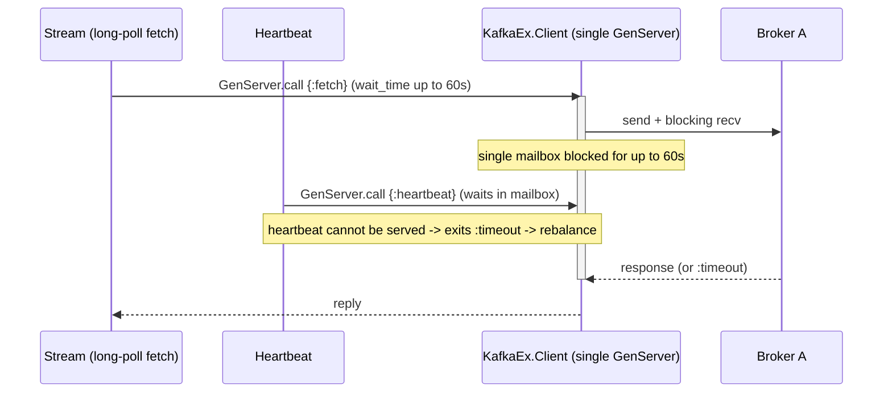
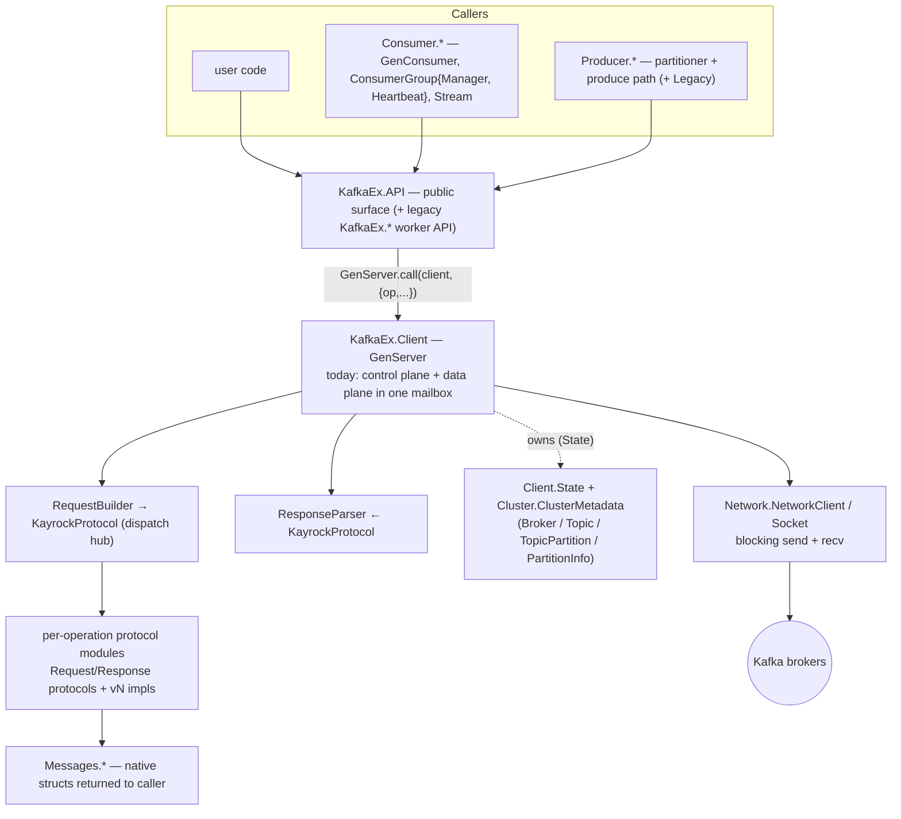
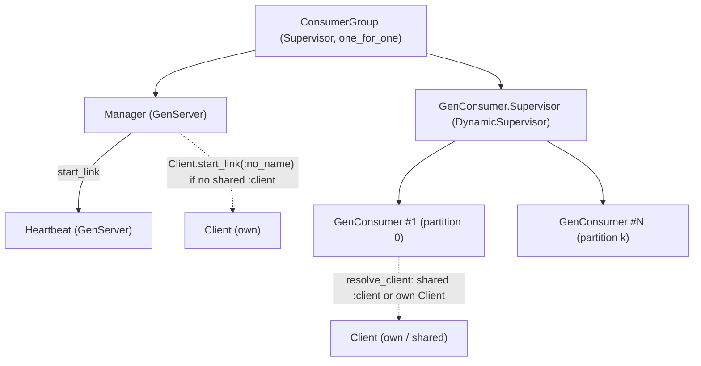

# RFC 0001: Non-blocking process architecture for `KafkaEx.Client`

- **Status:** Draft — request for comments
- **Author:** (KafkaEx maintainers / proposer)
- **Date:** 2026-07-28 (last updated 2026-08-18)
- **Target release:** v1.2.0 (delivered incrementally; the public API's shape is unchanged throughout)
- **Related issues:** #357 (`KafkaEx.stream` times out fetching at log-end), #445 (metadata cache not updated on produce)
- **Reviewers:** _(name 3–5; an RFC addressed to everyone is reviewed by no one)_
- **Review deadline:** _(set one — two weeks is usually enough)_
- **Supersedes** four earlier internal design notes: a pure `Broker` with a named connection, a
  decentralised data plane, a deepened `ClusterMetadata`, and a cluster-shared metadata store. This
  document is self-contained and restates whatever it needs from them; the shared store is rejected
  here rather than adopted (see Alternatives).

## Contents

**If you read only four sections**, read [Summary](#summary), [The problem](#the-problem),
[Design decisions](#design-decisions) and [Trade-offs](#trade-offs) — together they are what approval
commits you to. The rest is evidence and mechanism.

- [Summary](#summary) — the problem, the proposal and its cost, in three paragraphs
- [The problem](#the-problem) — the three failures, each traced to code
- [Where this sits in the current codebase](#where-this-sits-in-the-current-codebase) ·
  [Goals and non-goals](#goals-and-non-goals)
- [The proposed architecture](#the-proposed-architecture) — the model and the compatibility contract;
  the mechanism itself lives in four [companion references](#how-it-works-in-detail)
- [Design decisions](#design-decisions) — every decision with the evidence behind it
- [Delivery](#delivery) — the 7-PR plan, [Rollback](#rollback), [Test strategy](#test-strategy),
  [Benchmarks](#benchmarks), [Success criteria](#success-criteria)
- [Trade-offs](#trade-offs) — what this costs, worst first
- [Rationale and alternatives](#rationale-and-alternatives) ·
  [Security considerations](#security-considerations) · [Prior art](#prior-art)
- [Unresolved questions](#unresolved-questions) ·
  [Forward compatibility](#forward-compatibility--does-this-foreclose-anything) ·
  [Future possibilities](#future-possibilities) · [References](#references)

## Summary

**The problem.** `KafkaEx.Client` is one `GenServer` that holds at most one request in flight and
blocks inside `handle_call` waiting for a broker to answer. One slow or unresponsive broker therefore
stalls every other caller of that client. That is how a long-poll `fetch` at the log end times out
unrelated calls (#357), how metadata refresh races a produce into stale leader data (#445), and how a
single unreachable broker can rebalance an entire consumer group.

**The proposal.** Split that process into a small tree: a **control plane** that routes, retries and
owns metadata, and a **data plane** of per-broker, per-role `Connection` processes that each own one
socket, are event-driven rather than blocking, and block only themselves. Each client owns its own
supervised infrastructure; nothing is shared between clients.

**What it costs.** The public API does not change — not one function, option or return shape — and
neither do telemetry event shapes, error atoms, or the client's process identity. **One behavioural
change is deliberate:** today's single mailbox incidentally imposes a global order on requests from
*all* callers, and the new client preserves order only **per caller process**. That change, the
resource and complexity costs, and the migration cost to the test suite are set out in
[Trade-offs](#trade-offs); a configuration switch reverses the concurrency change in production
without a downgrade.

## The problem

`KafkaEx.Client` today is one `GenServer` that fuses three responsibilities into a single mailbox:

1. **Blocking per-broker socket I/O.** `NetworkClient.send_sync_request/3` flips the socket to
   `{active, false}` and blocks on `Socket.recv/3` **inside `handle_call`**
   (`lib/kafka_ex/network/network_client.ex:114-158`, driven from `client.ex network_request/4`).
2. **Metadata ownership and refresh.** Broker sockets live in `Broker.socket` inside
   `cluster_metadata` inside `Client.State`; the periodic refresh runs
   `:timer.send_interval → handle_info(:update_metadata)` in the *same* mailbox
   (`client.ex:171,384`).
3. **Retry / routing orchestration** (`handle_request_with_retry`, `refresh_for_error`).

A single monotonic `correlation_id` in `State` (`client.ex:1370`) means the client holds **at most
one request in flight** at any moment. Because everything shares one mailbox and one blocking
`recv`, a single broker freezes the whole client:

- **#357** — a long-poll `fetch` at the log end holds the `GenServer` for its full `wait_time`
  (up to ~60 s), so every other caller `GenServer.call` times out.
- **#445** — metadata reads and refresh queue behind slow socket I/O, so a produce can observe stale
  or mismatched topic metadata.
- **The black-holed-broker stall** (an internal finding; stated in full here because it is not a
  repository artifact) — one broker that is "black-holed" (TCP up, no application reply)
  monopolises the shared client; the consumer-group `Heartbeat`'s queued call then exits `:timeout`,
  the `Manager` rebalances, and if the stall exceeds `session_timeout` the coordinator evicts the
  member: **a group-wide rebalance triggered by one unrelated broker**.
- The v1.1.0 timeout changes (`request_timeout` 1 s → 15 s, `heartbeat_interval` 5 s → 3 s, fetch
  transport `:timeout` retried ×3) **lengthened these blocking windows** on top of the shared
  mailbox.

Separately, because each client owns its own metadata and sockets, a consumer group holds **N copies**:
in production the `Manager` **always** starts its own `Client` (its `:client` opt is test-only,
`manager.ex:266-270`), and every `GenConsumer` starts its own unless handed a shared `:client`
(`gen_consumer.ex:641,679-693`; `resolve_client/3`, #581) — so N metadata catalogs, N refresh loops,
and N socket sets to the same brokers.

Today's request flow — one blocking `recv` in one mailbox means one broker freezes everything:



The goal is to remove head-of-line blocking and make metadata handling correct **without changing
any public API** — the client must stay a drop-in for every existing caller (`KafkaEx.API`, the
legacy `KafkaEx.*` worker API, `ConsumerGroup.Manager`, `Heartbeat`, `GenConsumer`, `Stream`).

**Expected outcome (by design):** #357 and #445 eliminated by the split, the black-holed-broker stall
removed architecturally, and metadata refresh, heartbeats and produce to independent brokers
proceeding in parallel — with zero changes required from any library consumer. The
N-clients-per-group footprint is **not** removed here; it remains collapsible, as today, by handing
the group a shared `:client` (`resolve_client`, #581). Cross-client sharing of metadata and connections is a
possible future option (see Alternatives), not part of this change.

## Where this sits in the current codebase

Where this change sits in the existing module layout, in the project's own vocabulary — *public
surface → client → dispatch hub → per-operation protocol modules*, plus *control plane / data plane*,
*node selector*, *coordinator*, *cluster metadata model*, and *native message structs*.



**Layers (top → bottom):**

1. **Public surface — `KafkaEx.API`** (`api.ex`, `api/behaviour.ex`). The primary interface; every
   function takes `client` first and issues `GenServer.call(client, {op, …}, budget)`, returning
   `{:ok, result}` / `{:error, reason}` where `result` is a `Messages.*` struct. The legacy worker
   API (`kafka_ex.ex`: `create_worker`, `start_link_worker`, `KafkaEx.Supervisor`) sits alongside it
   for backward compatibility.
2. **Client — `KafkaEx.Client`** (`client/client.ex`), the `GenServer` that owns a cluster
   connection. Today it fuses **control plane** and **data plane**. Its support cast in `client/`:
   `state.ex` (`Client.State`), `node_selector.ex` (`NodeSelector`: `:first_available` /
   `:topic_partition` / `:consumer_group`), `request_builder.ex` / `response_parser.ex`,
   `request_context.ex` (`RequestContext`), `request_budget.ex`, `metadata_log.ex` (edge-triggered
   missing-topic logging), `error.ex`; plus shared `Support.Retry`, `Support.OptionalDeps`,
   `Telemetry` (the `[:kafka_ex, :request]` span), and `Config`.
3. **Dispatch hub — `Protocol.KayrockProtocol`** (`protocol/kayrock_protocol.ex`). The only place the
   rest of the client talks to the protocol layer: `build_request(op, api_version, opts)` and
   `parse_response(op, response)` branch by `{operation, version}`. Slated to become a separate
   package post-1.0.
4. **Per-operation protocol modules** (`protocol/kayrock/<operation>/`). Each operation defines the
   `Request`/`Response` Elixir protocols (`@fallback_to_any true`) plus one
   `vN_request_impl.ex` / `vN_response_impl.ex` per API version, an `any_*_impl.ex` forward-compat
   fallback, and shared `request_helpers.ex` / `response_helpers.ex`.
5. **Network — `Network.NetworkClient` / `Network.Socket`** (`network/`). Stateless plumbing:
   `create_socket`, `send_sync_request` (`{:packet, 4}` framing, the **blocking `Socket.recv`** that
   this RFC targets), `close_socket`. `network/behaviour.ex` is the mock seam (Mimic).
6. **Data model — `Cluster.*` and `Messages.*`.** `Cluster.*` (`cluster_metadata.ex`, `broker.ex`,
   `topic.ex`, `topic_partition.ex`, `partition_info.ex`) is the broker/topic/partition/leader model;
   `ClusterMetadata` also carries the **coordinator cache** and today transplants live sockets in
   `Broker.socket`. `Messages.*` are the native structs returned to callers (`Fetch`, `Fetch.Record`,
   `RecordMetadata`, `Offset`, `ConsumerGroupDescription`, …).

**Callers of the client.** All reach the client through `KafkaEx.API` → `GenServer.call(client, …)`:
`ConsumerGroup.Manager` (join / sync / leave, offset fetch / commit), `ConsumerGroup.Heartbeat`
(**its call is the one that exits `:timeout`** when the client is blocked → the black-holed-broker stall), `GenConsumer`
(fetch, offset commit), `Stream` (fetch; the long-poll at log-end is **#357**), `Producer.*`, and the
legacy `KafkaEx.*` worker API.

**Consumer-group process tree, and where the client comes from:**



In production the `Manager` **always** starts its own `Client` (its `:client` option is test-only),
and every `GenConsumer` starts its own unless handed a shared `:client`.
Hence the N-clients-per-group footprint named above — one this RFC leaves collapsible for the
`GenConsumer`s via a shared `:client`, not via auto-sharing (the `Manager`'s own client stays
separate). The new processes this RFC introduces (`Connection`, `ConnectionSupervisor`,
`MetadataStore`, and the supervisor that groups them) are **per-client infrastructure**: each
`Client` keeps its identity as a thin front and owns its own store and connection set, independently
supervised from the front.

## Goals and non-goals

**Goals.** In priority order, because they conflict at the margin:

1. **One slow or unresponsive broker must not affect requests to any other broker.** This is the
   whole point; everything else is subordinate to it.
2. **Metadata must stay correct under load** — reads must not queue behind socket I/O, and a
   concurrent refresh must not hand a produce a stale leader.
3. **Existing code must not change.** Every current caller — `KafkaEx.API`, the legacy worker API,
   `ConsumerGroup.Manager`, `Heartbeat`, `GenConsumer`, `Stream` — keeps working untouched.
4. **The change must be reversible in production**, without downgrading the dependency.

**Non-goals.** Each of these is a plausible next step that this RFC deliberately excludes, because
including any of them would change what approval means:

- **No public API change.** Not a single new function, option or return shape is required by this
  work. Anything additive (an async request primitive, pause/resume, a rebalance listener) is a
  separate proposal — see Forward compatibility.
- **No process-per-topic-partition data plane.** We adopt the per-broker (× role) split and stop
  there; the brod-style producer/consumer process per partition is explicitly rejected in
  Alternatives.
- **No cross-client sharing of metadata or connections.** Infrastructure is per-client. The
  N-clients-per-group footprint is *not* addressed here and stays collapsible the way it already is,
  via a shared `:client`.
- **No incremental fetch sessions (KIP-227), no idempotent or transactional producer, no cooperative
  rebalancing.** The design must not foreclose them, which is a weaker and cheaper obligation than
  building them.
- **No performance tuning as a goal in itself.** The target is removing head-of-line blocking. A
  throughput gain at high concurrency is expected to follow, but the benchmarks exist to catch a
  *regression*, not to chase a number.

## The proposed architecture

The mental model is a **control plane vs data plane** split, on two axes:

- **Data plane** = per-broker, per-role `Connection` processes. Each owns exactly one socket and its
  own `correlation_id`, is **event-driven** (`{active, once}` — never a blocking `recv`), and blocks
  only itself. A slow fetch on broker A no longer affects broker B, and coordinator/heartbeat traffic
  rides a *different* connection than data traffic even to the same broker. Connections belong to
  **one client**, resolved through that client's own `Registry`.
- **Control plane** = routing + retry (the front `KafkaEx.Client`, one per user client) and metadata +
  coordinator discovery (a **`MetadataStore` owned by that same client**). Each client owns the
  metadata for its own connection to the cluster.

Infrastructure is **per-client**: each `KafkaEx.Client` owns its own `MetadataStore` and connection
set, and two clients — even with identical credentials to the same cluster — never share a socket or
a metadata refresh. This keeps the trust boundary trivially safe (nothing crosses between clients)
and is the same choice the reference clients make by default (Java/librdkafka per-instance; brod
shares only via an explicitly named client). Auto-sharing metadata/connections across clients that
happen to share a `{bootstrap, ssl, auth}` identity is a **future option** (see Alternatives), not
built here.

From a caller's perspective **nothing changes**. A caller still writes:

```elixir
GenServer.call(client, {:fetch, topic, partition, offset, opts}, budget)
```

Under the hood the front `KafkaEx.Client` no longer blocks: it looks up the target (a lock-free ETS
read from the `MetadataStore`), hands the request to that broker/role `Connection` asynchronously,
and parks the caller until the answer comes back — while remaining free to serve heartbeats, metadata
refreshes, and requests to other brokers.

**Backward-compatibility contract (invariant):**

- `KafkaEx.Client` remains the named front process answering the same `GenServer.call({op, …})`
  messages.
- `start_link(args, name)` still returns `{:ok, pid}`, registers `name`, and is ready on return
  (synchronous fail-fast boot).
- `send_request/4`, `retry_count/0`, `coordinator_max_attempts/0` are unchanged. `send_request/4` in
  particular keeps **send-once, no-retry** semantics: today its handler bypasses the retry loop
  entirely (`client.ex:371-375`, unlike `handle_request_with_retry`), so the front must **exempt** it
  from the uniform `{:done, …}` retry classification. Without that exemption it would silently gain
  retries — one `:timeout` today, up to three afterwards. It remains a deliberate escape hatch to the
  ~28 Kafka APIs Kayrock generates but `KafkaEx.API` does not wrap, and is documented as such in
  `usage-rules.md`.
- **Error atoms are unchanged, and this RFC introduces none.** Every failure mode maps onto an atom
  already in `KafkaEx.Support.Retry`'s classification, because an unknown atom falls through
  `transient_error?/1` to `false` and would silently turn a retryable condition into a fatal one. The
  atoms the front returns are exactly today's: `:timeout` (written but unanswered — retryable, except
  on coordinator requests where send-once applies), `:not_connected` (never written — parks, never
  fatal), `:no_broker` (no target selectable, including from a `:degraded` store), plus the unchanged
  broker error codes.
- **One behavioural change, stated deliberately.** Today's single `GenServer` imposes a *global total
  order* on every request from every caller — an accident of having one mailbox. The front preserves
  order only **per caller process**; requests from different processes become genuinely concurrent and
  may reach the broker in either order. Worth naming concretely: two processes committing offsets for
  the same partition can now move the committed offset backwards (redelivery — at-least-once still
  holds, nothing is lost). The common path is unaffected, because `GenConsumer` and `Stream` block on
  their own commit (`gen_consumer.ex:1026`, `stream.ex:182`), so at most one commit per
  (group, topic, partition) is ever in flight. **That is a load-bearing invariant of the consumer
  layer, not a coincidence** — any future change that stops the consumer blocking on its commit must
  supply an equivalent guarantee. We deliberately do *not* add a commit-ordering gate: none of the
  three reference clients gates commits (Java's consumer is single-threaded per instance; brod and
  librdkafka serialize through the group coordinator).
- All telemetry event **shapes** (names + measurements) are unchanged. Operation spans
  (`:produce`/`:fetch`/`:consumer.*`) stay in the front (same pid as today's client); the per-attempt
  `[:kafka_ex, :request]` span and the `:connection`/`:auth`/`:connection.close` events move to the
  `Connection` (their emitting pid changes). Under the async model emission shifts from the synchronous
  `Telemetry.span/3` wrapper to manual `:start`/`:stop`.
- The front client stays the failure unit that `ConsumerGroup` supervision monitors.
- `MetadataStore`, `Connection`, the per-client `Infra.Supervisor` grouping them, and the connection
  `Registry` are strictly internal; callers never address them.
- The OTP application boot (`KafkaEx.Supervisor`) and the `disable_default_worker` flag are unchanged:
  a disabled default worker still means no client and no connections until one is explicitly started,
  so `mix test.unit` still needs no Kafka cluster.

### How it works, in detail

The mechanism is documented in four companion references. They are **non-normative**: nothing in them
is a decision, and a reviewer approving this RFC is not approving their contents. They exist so that
the design can be checked for soundness and then built.

| Reference | Answers |
|---|---|
| [Request lifecycle](../references/0001/request-lifecycle.md) | What a request's state looks like while it is in flight, how the front resolves a target and classifies a result, and the five ways an entry ends |
| [Supervision, ownership and teardown](../references/0001/supervision-and-ownership.md) | Which process owns what, which edges are links and which are monitors, what a crash takes down, and how a client tears its infrastructure down |
| [Startup and application boot](../references/0001/startup.md) | What `start_link/2` does, why boot stays synchronous and fail-fast, and why `disable_default_worker` still means no sockets |
| [State machines](../references/0001/state-machines.md) | The `Connection` and `MetadataStore` `:gen_statem`s — their states, transitions, and what each state does and refuses to do |
## Design decisions

Grilled one branch at a time; the connection-model, metadata-ownership, in-flight and coordinator
findings were cross-checked against **brod, the Java client, and librdkafka** (3/3 unless noted).

| # | Decision | Evidence / rationale |
|---|----------|----------------------|
| 1 | **Retry in the front; `Connection` is a dumb pipe** (one attempt → reply to front) | 3/3: all put retry above the transport |
| 2 | **`Connection` keyed per (node, role)** — coordinator/metadata separate from data | 3/3: dedicated coordinator connection; removes the black-holed-broker stall architecturally |
| 3 | **One `MetadataStore` per client** (`:gen_statem`; states `:loading`/`:ready`/`:degraded`), lock-free ETS reads, single-writer, per-key coalesced refresh + FindCoordinator, notify | one coalesced owner decoupled from connections; none uses a blocking read path. Per-client (not shared): Java/librdkafka are per-instance |
| 4 | **Front request-lifecycle state machine** (`:resolving/:in_flight/:awaiting_*`); coordinator discovery owned by the store | preserves today's retry rules incl. coordinator send-once |
| 5 | **Synchronous, fail-fast boot** (front ensures its own infrastructure subtree, then uses it) | preserves start/supervision contract |
| 6 | **Front = `GenServer`; `Connection` = `:gen_statem`** (self-healing; `postpone`) | per-request state ⇒ map, not process FSM; connection has real protocol states (librdkafka parallel) |
| 7 | **Per-client infra (`MetadataStore` + connections), supervised independently of the front but living/dying with the client** | front can't be a supervisor (caller holds its pid); no cross-client sharing ⇒ no teardown/ref-counting question |
| 8 | **`Transport` behaviour + in-process fake transport for unit tests** (+ some fake-broker + integration) | forced by `{active, once}`; mechanical port of existing stubs |
| 9 | **Multi-in-flight per connection matched by `correlation_id` map; ≤ 1 in-flight per partition for produce ordering** | 3/3 multiplex; Java mutes / idempotent-gates, brod `partition_onwire_limit`, librdkafka clamps under idempotence |
| 10 | **One multiplexed connection per (node, role), shared — not a connection pool** | 3/3: Kafka multiplexes over one TCP via `correlation_id` and orders per-connection; a pool multiplies FDs / broker-side conns for no throughput gain and breaks produce ordering |
| 11 | **No cross-client sharing of metadata/connections** (deferred future option, keyed by `{sorted bootstrap uris, ssl_options, auth}`) | brod shares only via an explicitly named client; auto-sharing adds teardown + blast-radius cost for a footprint already collapsible via a shared `:client` |
| 12 | **Front owns a linked `Infra.Supervisor` started in `init`, non-trapping; teardown via the link; sockets closed in each `Connection`'s `terminate/2`** | brod_client is the closest precedent (a worker owning its sub-supervisors); verified empirically that the parent-link tears the subtree down on any exit reason (incl. `:normal`) and that fail-fast `init` needs no `trap_exit` |
| 13 | **Per-partition produce-ordering gate lives in the front** (`max N in-flight per partition`, FIFO-parked): `N = 1` mute now, `N ≤ 5` idempotent-sequence gating deferred with the idempotent producer. A slot is held for the whole **logical** request — across retries, *not* per dispatch — and released on every terminal path (reply, retry exhaustion, deadline expiry, caller `:DOWN`, connection `:DOWN`), each release waking the next FIFO waiter | the gate and retry must co-locate, and retry is in the front (#1); 3/3 put the gate above the transport (brod `partition_onwire_limit`, Java mute, librdkafka toppar); releasing per dispatch would let a second producer interleave *between* attempts, defeating the ordering the gate exists for, and an unreleased slot silently stalls one partition forever |
| 14 | **In-flight requests keyed by a fresh `ref` per physical dispatch (staleness); a separate persistent `attempt` counter for backoff / max-retries / telemetry** | 3/3 decouple the two — brod `corr_id` vs `failures`, Java `correlationId` vs `ProducerBatch.attempts` (→ `record-retry-total`), librdkafka `rkbuf_corrid` vs `rkbuf_retries`; opposite lifetimes, so no single token does both |
| 15 | **Telemetry split by what a span measures: operation spans (`:produce`/`:fetch`/`:consumer.*`) stay in the front (same pid as today's client); the per-attempt `[:kafka_ex, :request]` span + `:connection`/`:auth`/`:connection.close` move to the `Connection`. Async forces manual `:start`/`:stop` (stored timestamps) instead of the synchronous `Telemetry.span/3` wrapper** | verified `client.ex:1383` — `[:kafka_ex, :request]` wraps one serialize→send→recv (bytes + broker), *not* the retried op; event names/measurements unchanged, only the transport events' emitting pid changes (front→Connection) → review tests asserting on emitter pid |
| 16 | **`MetadataStore` stays a `:gen_statem` with *lifecycle* states `:loading`/`:ready`/`:degraded` (NOT a `:refreshing` state); refresh/discovery is per-key `in_flight` data** | `:degraded` (cluster unreachable → serve stale + `degraded`/`recovered` telemetry + bounded refresh) is a genuine behavioural mode that earns the FSM; a `:refreshing` state would force global single-flight, conflicting with per-key coalescing (research: 3/3 model in-flight refresh as data, not a state) |
| 17 | **`FindCoordinator` discovery coalesced in-flight per `(coordinator_type, key)`, kept separate from metadata refresh** | de-storms concurrent re-discovery for one group (Manager + Heartbeat + commit at once); one step beyond brod/Java/librdkafka (which dedup only the resolved result or coalesce per-instance) — cheap on the BEAM (a waiter list) |
| 18 | **`Connection` `postpone`s only during an active connect (bounded window, `:connecting`); outside it the error atom is keyed on whether the request's bytes reached the socket — never written → `{:error, :not_connected}` (front parks it, no attempt spent); written but unanswered → `{:error, :timeout}` (a real attempt; coordinator send-once applies)** | bounds mailbox growth without moving the caller's deadline into the `Connection`, which never learns it; the split preserves today's send-once rule, whose reason is that the broker may already have executed a *written* request — a distinction one atom cannot carry; matches Java (`client.ready` gate + connect timeout) / librdkafka (outbuf message-timeout) |
| 19 | **`MetadataStore` is the sole owner of its `:protected`, single-writer ETS table; on a store crash the table is discarded and the restarted store rebuilds it** (reads briefly miss → front parks and re-resolves) | an ETS `heir` to preserve the table was considered and rejected as over-engineering: a BEAM table dies with its owner, so preserving it needs another live process holding it, and the brief rebuild park (one metadata fetch, one client) is cheaper than that machinery |
| 20 | **Rollback is `request_concurrency: :multiplexed` (default) \| `:serial`, implemented as a cap of one simultaneously admitted `pending` entry — not as a second request path**; temporary, removed in 1.3.0 | one entry at a time makes mailbox order equal execution order, restoring today's global total order exactly, without keeping two retry implementations alive in one release; a `:legacy` *code path* would be a third configuration nobody runs in production, and after PRs 1–5 there is no old path left to select anyway. Default `:multiplexed` because a safe default means the new path goes unexercised until the flag is removed — deferring risk, not reducing it |
| 21 | **A request the broker will not answer (`produce` with `acks: 0`) is completed by the `Connection` on a successful socket write**: `{:done, ref, :ok}`, no `correlation_id` registered, no per-attempt timeout armed; the front replies success without an offset and never retries it | there is no response to correlate, so a front that waited would park the caller to its deadline and report `{:error, :timeout}` for a send that succeeded; today `client.ex:1356` already branches on `acks == 0`. No retry, because a resend can duplicate records and no acknowledgement could ever say whether the first attempt landed (`client.ex:851-853`) |
| 22 | **The caller's absolute deadline is admitted with the request** — `KafkaEx.API` passes the budget it already computes with `RequestBudget.call_budget/2` into the request message, and the front stores `deadline = monotonic_now + budget` on the `pending` entry, checking it before every dispatch | a `GenServer.call` timeout is caller-side only, so a front that never receives the deadline cannot honour it; re-deriving it from `network_timeout` and `@retry_count` would be a second computation of one budget — the drift #562 closed by making `@retry_count` the single source of truth — and would be wrong for `send_request/4`, where the caller may pass an arbitrary timeout |
| 23 | **The front monitors each caller, and an entry is cleaned up on all five terminal paths** (reply, retry-budget exhaustion, deadline expiry, caller `:DOWN`, `Connection` `:DOWN`), each cleanup releasing any produce-gate slot and waking the next FIFO waiter | an orphaned entry does not merely leak memory: holding a gate slot at `N = 1` stalls that partition silently and permanently. Monitor and deadline are complementary — the monitor catches a caller killed by its own `GenServer.call` timeout, the deadline catches one that survived by catching the exit |

## Delivery

Ships **incrementally** as reviewable, individually releasable PRs. The organising rule is that
**PRs 1–5 move responsibilities between processes without changing observable behaviour, and PR 6 is
the single semantic cutover.** Everything a reviewer must scrutinise for behaviour change, and
everything a rollback would have to undo, is therefore concentrated in one place instead of smeared
across the series. The public API's **shape** is unchanged throughout, so no step is source-breaking;
the one observable behavioural change — the loss of the global cross-caller request ordering that
today's single mailbox imposes — is stated in the compatibility contract and lands with PR 6.

| # | PR | What moves | Observable change |
|---|---|---|---|
| 1 | **Pure `Broker` + `Transport` seam** | The socket leaves the `Broker` struct, which becomes a plain value; the client holds a separate `node_id ⇒ connection` map; a `Transport` behaviour wraps `NetworkClient`, with an in-process fake for tests | None. Metadata refresh stops transplanting live sockets, which is a latent-bug fix, not a contract change |
| 2 | **Selection + coordinator cache into `ClusterMetadata`** | Leader/controller/coordinator selection and refresh-on-error move out of `Client` (today `client.ex:1061-1174`) behind a small interface | None; still in-process and synchronous |
| 3 | **`Connection` as `:gen_statem`** | One connection per `{host, port, role}` under a `ConnectionSupervisor` + `Registry`, both owned by the client's `Infra.Supervisor`; sockets, SASL and ApiVersions negotiation move into it. **The client still calls it synchronously** | None by contract. The largest single step and the first candidate to split further |
| 4 | **`MetadataStore` as `:gen_statem`** | ETS table, the store's own `:metadata` connection, per-key coalesced refresh and `FindCoordinator`; the client reads ETS lock-free instead of holding `cluster_metadata` in its state. Request path still synchronous | Closes #445 on its own |
| 5 | **Telemetry split + deadline threading** | Per-attempt `[:kafka_ex, :request]` and the `:connection`/`:auth` events move to the `Connection`; operation spans stay in the front. Separately, `KafkaEx.API` threads the caller budget it already computes into the request message | Emitting pid changes for transport events; shapes identical. The threaded deadline is unused until PR 6, which is what keeps that PR small |
| 6 | **Cutover: the non-blocking front** | `handle_call` returns `{:noreply, …}`; the `ref`-keyed `pending` map, absolute deadlines, caller monitors, the per-partition produce gate, and the retry state machine | **The one semantic step.** Order becomes per-caller rather than global; head-of-line blocking (#357) and the black-holed-broker heartbeat stall are removed here |
| 7 | **Cleanup** | Delete the recursive synchronous retry loop and the now-dead `send_sync_request` paths | None |

Ordering note: the `Connection` (3) deliberately precedes the `MetadataStore` (4), even though the
store closes #445 and would deliver visible value sooner. The store owns its own `:metadata`
connection, so landing it first would mean giving it a connection in the old shape and then rebuilding
it in step 3 — paying for the same work twice.

### Rollback

A minor bump carrying a concurrency change needs an escape hatch, and we have our own precedent for
why: v1.1.0's metadata-refresh behaviour change required the unplanned v1.1.1 patch cycle three days
later, and two entries in that changelog are marked "Behavior change". PR 6's failure mode is worse in
kind — races, the class that survives CI and appears under production load.

The escape hatch is **`request_concurrency: :multiplexed` (default) | `:serial`**, and the important
part is what it is *not*: it does **not** select between two request paths. `:serial` caps the number
of simultaneously admitted `pending` entries at **one**. Same state machine, same retry
classification, same telemetry — the front simply handles entries one at a time, so mailbox order
becomes execution order again and today's global total order is restored exactly. There is no second
retry implementation to keep alive, which matters because retry is where the correctness lives.

Two things about it must stay explicit:

- **It restores head-of-line blocking on purpose.** A user choosing `:serial` is knowingly trading
  back the #357 and black-holed-broker fixes for the old ordering. That is the correct trade for a rollback switch
  and a bad one for a default.
- **It does not roll back the process topology.** Sockets still live in `Connection`s and metadata in
  the `MetadataStore`, so a defect introduced by PR 3 or PR 4 is *not* recoverable with this flag; for
  those, the rollback is a version pin to 1.1.x. The flag covers the cutover, nothing else.

The default is `:multiplexed` from 1.2.0 rather than a cautious `:serial`. A safe default sounds
prudent but means nobody exercises the new path, so its defects surface only when the flag is removed
— deferring the risk instead of reducing it, while withholding the fixes that motivate the work.
`:serial` is documented from the outset as a temporary hatch, slated for removal in 1.3.0.

### Test strategy

The existing suite carries a **quantified migration cost, and it falls due at PR 3, not PR 6**. Eight
test files make **26 direct `handle_call/3` calls**, asserting on the synchronous return value.
`test/kafka_ex/client/transport_error_test.exs:27-29` already flags the exposure — "the request runs
in THIS process … a future refactor to a real GenServer would need `set_mimic_global`" — though the
cost is larger than a change of mock mode: after the cutover `handle_call/3` returns
`{:noreply, state}`, so there is no value left to assert on, and these become rewrites against the
async protocol. They come due at PR 3, because that is where I/O first
leaves the test process: Mimic's private mode binds stubs to the *calling* process, so stubs set in a
test stop applying the moment the socket lives in a `Connection`.

- **The answer is the injected fake, not `set_mimic_global`.** Decision #8's `Transport` behaviour and
  the fake `Connection` are passed in as configuration, so tests stay `async: true` and deterministic.
  Global Mimic mode would force `async: false` across the client suite and reintroduce cross-test
  interference — curing the symptom at the cost of the property that makes the suite trustworthy. The
  ten `NetworkClient` stub sites migrate onto the fake.
- **CI's automatic retries must be off for PRs touching the front.** `integration-tests.yml` (four
  jobs) and `chaos-tests.yml` each retry failures twice. That masks precisely the failure class this
  refactor introduces: a genuine race looks like a flake and passes on the second attempt. For the
  duration of the cutover a retry is evidence, not noise.
- **Model-based coverage of the front's state machine** (**proposed — needs maintainer sign-off, as it
  adds `{:stream_data, "~> 1.1", only: [:dev, :test]}`**). The invariants at risk are quantified over
  *interleavings*, so example tests can only sample them: every admitted entry reaches **exactly one**
  terminal path; no gate slot is ever leaked; the retry budget never goes negative; no entry replies
  twice. A leaked gate slot stalls one partition silently and forever, which is exactly what retried
  CI hides. **This is worth doing only if the front's decision logic is a pure
  `transition(entry, event) → {entry', effects}` function** — then the property test needs no
  processes, no sockets and no clock, runs fast, and shrinks to a readable counterexample. If that
  logic is instead spread across `handle_info` clauses, a property test would have to drive a live
  process against wall-clock time, would be slow and flaky, and should not be written; stay with
  example tests in that case. The purity requirement is worth adopting on its own merits: it keeps
  every retry decision in one readable place.

### Benchmarks

There is no benchmark infrastructure today — no `bench/` directory and no `benchee` dependency — so a
baseline has to be created before anything moves. A small suite lands in **PR 1**, precisely so the
baseline exists while the client is still the code we ship, and is re-run after PRs 3, 4 and 6.

Two costs this architecture introduces are worth measuring rather than asserting away:

- **A cross-process hop per request.** Two extra message sends in each direction. Cheap on the BEAM,
  not free.
- **An ETS read per request copies the term out of the table.** Today metadata lives in the client's
  own process state, so a leader lookup is a map read with no copy. This is not an argument against
  ETS; it is an argument for a **narrow** read, and we adopt that as a design constraint: the hot-path
  lookup is keyed `{topic, partition}` and returns the minimal routing tuple. Reading a whole topic's
  partition structure per request would be a copy that does not exist today.

Measure produce and fetch throughput and p99 latency at **1, 10 and 100 concurrent callers**. The two
ends carry different burdens of proof: the **single-caller** case is the one at risk — it pays the hop
and the copy and gains nothing from multiplexing — while the **100-caller** case is where the win must
appear, since without it the work has no justification. The acceptance threshold for single-caller
regression is deliberately left for the maintainers to set once PR 1's baseline exists; naming a
percentage now would be inventing one.

`benchee` (dev/test only) is proposed alongside `stream_data`; both are **subject to maintainer
sign-off**, as this RFC does not unilaterally add dependencies.

### Success criteria

The work is done, and this RFC is discharged, when all of the following hold:

1. **#357 is closed by construction**: a long-poll `fetch` at the log end no longer delays any other
   caller's request. Demonstrated by a test that issues a `fetch` with a long `wait_time` and asserts
   an unrelated `metadata` call returns promptly on the same client.
2. **The black-holed-broker stall cannot occur**: a broker accepting TCP but never replying stops
   affecting requests to other brokers, and a consumer-group `Heartbeat` is served throughout.
   Demonstrated in the chaos suite, which already has the fault injection for it.
3. **#445 is closed**: metadata reads no longer queue behind socket I/O, and a produce cannot observe
   the stale mismatched metadata that race produced.
4. **No behavioural change beyond the one declared.** The compatibility contract holds item by item:
   same public API shape, same process identity, same telemetry event shapes, same error atoms — with
   per-caller rather than global ordering as the single declared exception.
5. **No unexplained performance regression.** Single-caller p99 latency stays within the threshold the
   maintainers set against PR 1's baseline, and the 100-caller case shows the throughput improvement
   that justifies the work. A regression at high concurrency invalidates the premise and is a blocker,
   not a tuning task.
6. **`request_concurrency: :serial` reproduces today's behaviour** on the same test suite, so the
   rollback path is proven rather than assumed.

## Trade-offs

What this change costs, worst first. Items 1 and 2 are the ones a reviewer is being asked to accept;
the rest are consequences to be aware of.

**1. Request ordering weakens from global to per-caller.** This is the only observable behavioural
change, and it is permanent. Today's single mailbox serialises every request from every caller into
one total order — an accident of the architecture, not a documented guarantee, but real and relied
upon. The new client preserves order only within a caller process. Concretely: two processes
committing offsets for the same partition can now interleave and move the committed offset backwards,
causing redelivery. At-least-once still holds and nothing is lost. The common path is unaffected,
because `GenConsumer` and `Stream` each commit from the single process that owns the partition — an
invariant now recorded in the compatibility contract precisely so a later change cannot break it
unknowingly. Direct callers of `commit_offset/5` are warned in `usage-rules.md`.

**2. Concurrency bugs replace blocking bugs.** Converting a recursive, blocking retry loop into an
asynchronous `ref`-keyed state machine trades a failure mode that is obvious and reproducible for one
that is intermittent and load-dependent. This is the main correctness risk in the proposal. It is
mitigated, not eliminated: the cutover is confined to a single PR, a configuration switch reverses it
in production, and the test strategy exists specifically to attack interleavings. A reviewer who
believes that mitigation is insufficient should say so — it is the load-bearing claim of the whole
delivery plan.

**3. A per-request cost that did not exist before.** Every request now crosses a process boundary
(two extra message sends each way) and reads its routing target out of ETS, which copies the term;
today that read is a map lookup in the client's own state, with no copy. Single-caller latency is
expected to regress slightly, which is why the benchmarks measure it separately from the concurrent
case.

**4. The test suite pays a migration cost, at PR 3.** Twenty-six assertions across eight files are
written against a synchronous return value that stops existing. See Test strategy.

**5. More machinery.** The `Connection` `:gen_statem` (SASL and ApiVersions handshake, self-healing
reconnect) is more moving parts than a plain socket call, and async multiplexing must actively
preserve per-partition produce ordering and re-key `correlation_id` per connection — properties a
single blocking client got for free.

**6. Transport telemetry changes emitter.** `[:kafka_ex, :request]`, `:connection` and `:auth` move to
the `Connection`, so their emitting pid changes; operation spans stay in the front with the pid
unchanged. Event shapes are identical, but emission moves from the synchronous `Telemetry.span/3`
wrapper to manual `:start`/`:stop`. Tests asserting on the emitting pid must be reviewed.

**7. It moves KafkaEx away from its deliberately centralised design.** We bound that by stopping at
per-broker, per-role connections and a per-client store, rather than the per-partition process model
the alternatives section rejects.

**8. Per-client infrastructure multiplies the resource footprint.** N clients against the same cluster
keep N `MetadataStore`s, N refresh loops and N connection sets; the N-clients-per-group waste is *not*
removed here and stays collapsible only via a shared `:client`. We accept it because it keeps the
trust boundary trivial and the blast radius per-client, and because cross-client sharing can be added
later as an opt-in without a breaking change.

## Rationale and alternatives

- **Keep the monolith; tune timeouts only.** Does not remove head-of-line blocking; the v1.1.0 patch
  cycle showed timeout tuning only shifts the failure window.
- **Full process-per-topic-partition data plane** (brod-style `brod_producer`/`brod_consumer`).
  Rejected: reference clients and our review lenses flag it as over-engineering for KafkaEx's goals;
  it fights the centralized design and multiplies supervision complexity. We borrow the **per-broker
  (× role)** split, not the per-partition one.
- **Shared per-cluster metadata/connections (keyed by security identity).** Rejected as the default,
  kept as a future opt-in: it would remove the N-clients-per-group waste, but at the cost of
  cross-client blast radius, a subtree-teardown /
  ref-counting question, and a trust boundary that must be enforced on every socket. Reference clients
  are per-instance (Java, librdkafka) or share only through an explicitly named client (brod); the same
  footprint is already collapsible here via a shared `:client`.
- **A classic connection pool** (N interchangeable sockets per broker). Rejected: Kafka multiplexes
  over one connection and orders per-connection, so a pool adds cost and breaks produce ordering for
  no throughput gain; the throughput lever is the in-flight cap.
- **Front as `:gen_statem`.** Rejected: the front multiplexes many concurrent requests, so per-request
  state must live in a map, not in a single process state. The `Connection` is the correct FSM.
- **Chosen: control-plane / data-plane split with per-client infra.** Satisfies every driver
  (head-of-line blocking, #445, the black-holed-broker stall) and unifies the three earlier notes it supersedes — pure
  `Broker`, decentralised data plane, deepened `ClusterMetadata` — into one coherent target, replacing
  the fourth note's cluster-shared store with per-client infrastructure, while leaving sharing as a clean
  future opt-in.

## Security considerations

The change is close to neutral here, but not entirely, so the three points worth a reviewer's
attention:

- **The credential trust boundary stays trivial, and that is a deliberate consequence of per-client
  infrastructure.** Because no `Connection` is ever shared between clients, a socket authenticated
  with one client's SASL credentials can never carry another client's traffic. Cross-client sharing
  would have required enforcing that boundary on every socket — one of the reasons it is rejected as
  the default (see Alternatives).
- **SASL handshakes move into the `Connection` `:gen_statem`, and its `:authenticating` state must
  fail closed.** A connection that has not completed authentication is not `:connected`, so no
  request can be dispatched over it; the existing `:plain_requires_tls` enforcement moves with the
  handshake and is not weakened. Credentials must not appear in the `Connection`'s state dumps —
  `sys:get_state/1` and crash reports on a `:gen_statem` print state by default, which the current
  synchronous path does not expose in the same way.
- **The new telemetry emitters must not widen what is published.** The `:auth` events move to the
  `Connection`; their measurements and metadata stay as they are, and no credential material enters
  them.

No new network listener, no new port, no new configuration that accepts a secret, and no change to
how SSL options are resolved.

## Prior art

Source-grounded (read from current `master`/`trunk`), organised by the four axes the design turns on.

- **brod / kafka_protocol (Erlang).** `kpro_connection` is a `proc_lib` process per TCP connection,
  socket in `{active, once}`, pipelining multiple in-flight requests matched by a
  `correlation_id → caller` map (`kpro_sent_reqs`); it holds **zero** Kafka business logic. Retry
  lives above it in `brod_producer` (`is_retriable/1`, `schedule_retry`). Metadata + a connection
  registry (keyed by `{host,port}`) live in `brod_client`, with a **dedicated `meta_conn`** for
  metadata/coordinator; refresh is lazy, single-flighted by the mailbox. The group coordinator gets
  its **own dedicated connection** (explicit "connections in brod_client are shared … coordinator has
  to be dedicated"). Produce ordering: `partition_onwire_limit` default **1**.
- **Apache Kafka Java client.** `NetworkClient` + `Selector` is a single-threaded non-blocking loop
  (`poll()`), not thread-per-connection. `InFlightRequests` tracks a per-node `Deque` (FIFO;
  `correlation_id` for sanity only), `max.in.flight.requests.per.connection` default **5**. A single
  shared `Metadata` object single-flights its refresh (`needFullUpdate`/`needPartialUpdate` flags + a
  version counter); `metadata.max.age.ms` (periodic) + `metadata.max.idle.ms` (idle-topic eviction). Retry lives in
  `Sender`/coordinator (`InvalidMetadataException → metadata.requestUpdate`), never in
  `NetworkClient`. The coordinator is a separate logical connection (`GroupCoordinatorNode`, id
  prefixed `+`) to the same physical broker. Ordering: mute the partition at in-flight 1, or
  idempotent sequence-number gating up to 5.
- **librdkafka (C).** One thread per broker (`rd_kafka_broker_thread_main`, `rd_kafka_broker_t`) owning
  its socket; multiple in-flight matched by `correlation_id` in `rkb_waitresps`; `max.in.flight`
  default **1,000,000** (clamped to 5 with idempotence). A **global** `rk_metadata_cache` (per client,
  not per connection) with dedup via `rd_kafka_metadata_cache_hint` (skips a refresh already in
  flight); `topic.metadata.refresh.interval.ms` 300 000, `metadata.max.age.ms` 900 000. Retry/refresh
  decisions are in `rdkafka_request.c` (toppar-aware `RD_KAFKA_ERR_ACTION_REFRESH/RETRY`), transport
  is dumb. The coordinator is its **own logical broker + thread** (`rd_kafka_broker_add_logical`),
  separate from the physical broker's data connection.

**Mapping to this RFC:** (a) retry above the transport — 3/3; (b) a metadata owner decoupled from
connections — 3/3 (single-flighted in Java/librdkafka; brod owns it separately but re-fetches);
(c) multi-in-flight per connection — 3/3; (d) coordinator on its own connection — 3/3. None fuse socket I/O and metadata in one mailbox as KafkaEx does today.

## Unresolved questions

Nothing in the design is left undecided; every choice and its justification is in **Design decisions**
above. What this RFC deliberately does not fix is implementation-level and belongs to code review:
exact timer and backoff constants (connect window, reconnect backoff, `:degraded` bound, retry
budget), the precise `:degraded` refresh policy (fail fast or park within a bound), and the ETS
snapshot representation. **Forward compatibility** and **Future possibilities** below list
capabilities deliberately deferred.

Two questions are genuinely open and need a maintainer answer before implementation starts:

- **Two dev-only dependencies** — `stream_data` for model-based coverage of the front's state machine
  and `benchee` for the baseline. Both are argued for under Test strategy and Benchmarks; neither is
  added unilaterally by this RFC.
- **The single-caller latency threshold**, which can only be set once PR 1 establishes a baseline.

## Forward compatibility — does this foreclose anything?

Three capabilities we do not build here but must not paint ourselves out of. For each: is it
possible, does this design *block* it, what is already present, what stays additive, and the **one
constraint** to respect so we keep the door open.

### Transactional / idempotent producers

**Possible, and this design *enables* rather than blocks it.** The wire layer is already in place:
`transactional_id` is carried on Produce V3–V8, and `KafkaEx.API.find_coordinator/3` **already**
accepts `coordinator_type: :group | :transaction` (`api.ex:723-737`, `messages/find_coordinator.ex`).
What is missing is purely client-side session logic: `InitProducerId`, `AddPartitionsToTxn`,
`AddOffsetsToTxn` / `TxnOffsetCommit`, `EndTxn`, and a per-`(producer_id, partition)` sequence counter
in the produce path (today only `messages/fetch.ex` reads `producer_id`).

This architecture is the right substrate for three reasons: (a) the **coordinator role** generalizes
directly — the transaction coordinator is just `coordinator_type: :transaction` on the same dedicated
`:coordinator` connection and the same store-owned `FindCoordinator`; (b) **decision #9** (≤ 1
in-flight per partition, or idempotent sequence-number gating) is exactly what idempotent/transactional
produce requires (strict per-partition order, bounded in-flight, no gaps); (c) **retry lives in the
front** (decision #1), which is the one place re-sequencing on retry must happen. A single multiplexed
`:data` connection is fine — the broker tracks sequences per `producer_id`, so different producers'
writes may interleave on the wire.

**Constraint to keep the door open:** the transactional session (pid/epoch, per-partition sequence,
added-partitions set, commit/abort state, epoch fencing) is **producer-session control-plane state
with a single owner per `transactional.id`** and strict in-order, gap-free dispatch per partition. It
must layer **above** the `Connection`, not inside it — connections stay dumb pipes; sequence state
never scatters into them.

### Broadway / GenStage integration

**Possible, and this design *unblocks* it** (there is no Broadway/GenStage code today; the official
`BroadwayKafka` is `brod`-based, so this would be a new connector). A Broadway producer is a
**demand-driven (pull)** GenStage producer, whereas KafkaEx's consumer is **push**
(`GenConsumer.handle_message_set`); a connector would drive fetch itself on demand rather than through
`GenConsumer`. The blocker today is precisely **#357** — a blocking fetch stalls the whole client, so
a demand-driven pipeline stage would freeze. Removing head-of-line blocking (per-broker isolation) and
making heartbeats reliable under load (fixing the black-holed-broker stall) is exactly what a Broadway pipeline needs.

**Constraint to keep the door open:** KafkaEx has **no async request primitive today**, and this RFC
does not add one — `send_request/4` is, and stays, blocking and send-once (see the compatibility
contract). The constraint is therefore about *not foreclosing* one: the front's internal
`{:done, ref, result}` path must keep a shape into which a future **additive** public async API (a
call that returns a `ref` and later delivers `{:done, ref, result}` to the caller) can be layered
without rearchitecting the front. Without such a primitive a pull pipeline is capped at one in-flight
fetch per producer process. That future API is also the single place where the free-backpressure
property (one in-flight call per caller process) stops holding, so it — not this RFC — is where a
per-connection in-flight cap becomes necessary (decision #9).
Everything else stays additive — the `Broadway.Producer` (assignment, ack → offset commit,
drain-before-revoke) lives in the connector; KafkaEx itself need not become GenStage-aware.

### Distributed Erlang (one Kafka cluster, many BEAM nodes)

**Not blocked — the design is node-local by construction, which is the correct default.** All of a
client's infrastructure — the Elixir `Registry`, the metadata ETS table, the TCP sockets — is
node-local, **not** shared across the Erlang cluster. Each BEAM node connects to Kafka independently;
Kafka's own group coordinator handles membership across processes, nodes, and hosts. We deliberately
do **not** route Kafka traffic over Erlang distribution (serializing payloads over dist, coupling node
lifetimes, and head-of-line blocking on the dist channel is an anti-pattern). Addressing a front from
another node is unchanged: `:name` may still be `{:global, term}` (`api.ex:265-268`), and
`GenServer.call({:global, name}, …)` routes the request to the front's node, which uses *that* node's
local infra.

**Constraint to keep the door open:** register a client's infra (`MetadataStore`, connection
`Registry`, the per-client supervisor) with a **node-local** name/registry — **never `:global`**. A
global store/supervisor would concentrate every node's Kafka sockets onto one node and force all other
nodes' traffic across Erlang distribution: a bottleneck and a coupling. The front's own optional
`:global` `:name` is orthogonal and stays allowed. Should cross-client sharing ever be added, this
same node-local constraint applies to the shared subtree.

## Future possibilities

- Per-partition producer processes with send buffers (only if measurements justify it — deliberately
  out of scope here).
- A bounded, configurable number of `:data`-role connections per broker (a small pool) *only* if
  measurements ever show a single multiplexed socket is the bottleneck — and never splitting one
  partition's produces across sockets (would break ordering).
- Independent liveness detection (TCP keepalive / periodic probe) so the transport timeout is no
  longer the sole detector of a silently-hung broker.
- Partition-count-change awareness and cooperative rebalancing, which an actively-refreshed
  metadata store makes materially easier.

## References

- `lib/kafka_ex/client/client.ex`, `lib/kafka_ex/client/state.ex`,
  `lib/kafka_ex/network/network_client.ex`, `lib/kafka_ex/cluster/broker.ex`
- Issues #357, #445
